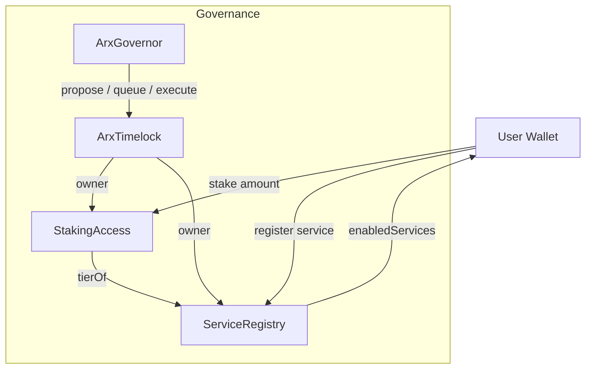

# ARX architecture

## Understanding of ARX NET Slice

***

### What is ARX NET Slice?

* Smart contracts (Foundry):
  * `ARX` — ERC20 + Permit + Burnable + AccessControl (MINTER\_ROLE) + ERC20Votes
  * `ArxTokenSale` — accepts USDC, forwards 100% to silo, mints ARX at USDC price
  * `ArxZapRouter` — swaps any ERC20/ETH to USDC via Uniswap V3, then `buyFor()`
  * `ArxGovernor` + `ArxTimelock` — upgradeable governance based on ERC20Votes + Timelock
  * `StakingAccess` — stake ARX (6‑dec) to reach access tiers (array‑based; defaults 1/10/100 ARX). Two‑step unstake with 30‑day cooldown.
  * `ServiceRegistry` — EOA self‑registration for services (Relay/VPN/Merchant and C\_\* variants) gated by staking tiers; includes `enabledServices(address)` view.
* Web app (Next.js):
  * Landing with parallax roadmap
  * `/buy` flow (wallet connect; quote via Uniswap Quoter; approvals/zap)
* Shared packages: UI, config (addresses/env), ABI
* Tooling: pnpm workspaces, Turborepo, ESLint/Prettier, Husky + lint-staged
* CI: GitHub Actions (lint + forge tests)

Price formula: `arxOut = (usdcAmount * 10^arxDecimals) / priceUSDC` (ARX uses 6 decimals).

***

### Current Testnet Deployment (Sepolia)

* ARX: `0x0cCDaB7eEf5a5071a39bBdbB0C3525D8780E3e1A`
* ArxTokenSale: `0xFBf0853e6962f219B7A414e548fA0239284A9246`
* ArxTimelock: `0x056a87133Be7674f4a4F99861FCCa4848b25f3d6`
* ArxGovernor: `0xe85755b07955155a2723458365452BC6C03FE7e6`
* StakingAccess: `0xF676135E8eE1239FA7C985fBe3742CF3BeB80b0C`
* ServiceRegistry: `0x4f5052F8bdf2e5CE3632CA8366055273c9F87AC8`
* ArxMultiTokenMerkleClaim: `0x1a2A187bC43cd95842Af42Ba7471636Be51FA091`

***

#### Addresses Table (Sepolia)

| Contract                        | Address                                      | Etherscan                                                                                                                                                          |
| ------------------------------- | -------------------------------------------- | ------------------------------------------------------------------------------------------------------------------------------------------------------------------ |
| ARX (ERC20Votes, UUPS)          | `0x0cCDaB7eEf5a5071a39bBdbB0C3525D8780E3e1A` | [https://sepolia.etherscan.io/address/0x0cCDaB7eEf5a5071a39bBdbB0C3525D8780E3e1A](https://sepolia.etherscan.io/address/0x0cCDaB7eEf5a5071a39bBdbB0C3525D8780E3e1A) |
| ArxTokenSale (UUPS)             | `0xFBf0853e6962f219B7A414e548fA0239284A9246` | [https://sepolia.etherscan.io/address/0xFBf0853e6962f219B7A414e548fA0239284A9246](https://sepolia.etherscan.io/address/0xFBf0853e6962f219B7A414e548fA0239284A9246) |
| ArxTimelock (UUPS)              | `0x056a87133Be7674f4a4F99861FCCa4848b25f3d6` | [https://sepolia.etherscan.io/address/0x056a87133Be7674f4a4F99861FCCa4848b25f3d6](https://sepolia.etherscan.io/address/0x056a87133Be7674f4a4F99861FCCa4848b25f3d6) |
| ArxGovernor (UUPS)              | `0xe85755b07955155a2723458365452BC6C03FE7e6` | [https://sepolia.etherscan.io/address/0xe85755b07955155a2723458365452BC6C03FE7e6](https://sepolia.etherscan.io/address/0xe85755b07955155a2723458365452BC6C03FE7e6) |
| StakingAccess (UUPS)            | `0xF676135E8eE1239FA7C985fBe3742CF3BeB80b0C` | [https://sepolia.etherscan.io/address/0xF676135E8eE1239FA7C985fBe3742CF3BeB80b0C](https://sepolia.etherscan.io/address/0xF676135E8eE1239FA7C985fBe3742CF3BeB80b0C) |
| ServiceRegistry (UUPS)          | `0x4f5052F8bdf2e5CE3632CA8366055273c9F87AC8` | [https://sepolia.etherscan.io/address/0x4f5052F8bdf2e5CE3632CA8366055273c9F87AC8](https://sepolia.etherscan.io/address/0x4f5052F8bdf2e5CE3632CA8366055273c9F87AC8) |
| ArxMultiTokenMerkleClaim (UUPS) | `0x1a2A187bC43cd95842Af42Ba7471636Be51FA091` | [https://sepolia.etherscan.io/address/0x1a2A187bC43cd95842Af42Ba7471636Be51FA091](https://sepolia.etherscan.io/address/0x1a2A187bC43cd95842Af42Ba7471636Be51FA091) |

Note: On Sepolia, USDC permit (EIP-2612) can reject; the web falls back to approve-only.

***

### Architecture & Contract Binding (Schema)

* Upgradeability
  * All core contracts are UUPS upgradeable behind `ERC1967Proxy` and initialized via `initialize(...)`.
  * Upgrades authorized by owner/admin in `_authorizeUpgrade`.
* Binding (addresses and roles)
  * `ArxTokenSale.USDC` → USDC ERC-20 (6 decimals)
  * `ArxTokenSale.ARX` → `ARX` token (UUPS proxy)
  * `ArxTokenSale.silo` → treasury that receives 100% of USDC
  * `ArxTokenSale.zappers` → allowlist for routers/zappers that can call `buyFor`
  * `ARX.MINTER_ROLE` → granted to `ArxTokenSale` so it can mint to buyers
  * `ArxZapRouter` holds: `USDC`, `WETH9`, `swapRouter (UniswapV3)`, and the bound `sale`
  * `GenericZapper` holds: `WETH9` and `swapRouter`
* Data flow (direct buy)
  1. User approves `ArxTokenSale` to spend USDC
  2. User calls `sale.buyWithUSDC(usdcAmount)`
  3. `sale` transfers USDC → `silo`, computes ARX, mints to `msg.sender`
* Data flow (zap + buy)
  1. User calls `ArxZapRouter.zapAndBuy` (or `zapETHAndBuy`) with a path that ends in USDC
  2. Router swaps input → USDC via Uniswap V3, output to router
  3. Router approves `sale` and calls `sale.buyFor(buyer, usdcOut)`
  4. `sale` transfers USDC → `silo`, mints ARX to `buyer`
* Generic Zapper (standalone)
  * `GenericZapper.zap(tokenIn, outToken, ...)` swaps ERC-20 or ETH to `outToken`, validates that `path` tail matches `outToken`, and immediately transfers outputs to `recipient` (no claim state).
  * Optional EIP-2612 permit supported via `(permitOwner, permitValue, permitDeadline, permitV, permitR, permitS)`; ETH path wraps via WETH9.
* Security & safety
  * Approvals: allowance-check + `forceApprove` (OZ v5) for non-standard tokens
  * Reentrancy: checks-effects-interactions; route swap output to self before external calls; clear allowances after use
  * Validation: revert on zero amounts; validate zap path last token (`USDC` for router, `outToken` for generic)
  * Pausable: routers/zappers are pausable; external zap functions guarded with `whenNotPaused`
* High-level schema (on-chain flows)

```
[User Wallet]
   |  approve USDC
   v
[ArxTokenSale (Proxy)] --USDC--> [Silo Treasury]
          |  mint
          v
      [ARX (Proxy)]  (to Buyer)

[User Wallet] --(ETH/ERC-20 + path)--> [ArxZapRouter]
      |           swap via Uniswap V3 to USDC (to router)
      v                                              |
  [ISwapRouter]  ------------------------------------
                                                   approve
                                                     |
                                                     v
                                 [ArxTokenSale.buyFor(buyer, usdc)]
                                                     |
                                                     v
                                   USDC -> Silo, ARX minted to buyer
```

***

### Governance & Voting

* Vote token: `ARX` implements `ERC20Votes` (upgradeable) with 6 decimals.
  * Holders can `delegate` to themselves or others; votes are checkpointed for `getVotes` queries.
  * Permit-enabled approvals and burnable supply.
* Timelock: `ArxTimelock` (UUPS + `TimelockControllerUpgradeable`)
  * Enforces a delay for queued proposals before execution.
  * Roles: `PROPOSER_ROLE`, `EXECUTOR_ROLE`, `CANCELLER_ROLE` (granted to governor by default in deploy script).
* Governor: `ArxGovernor` (UUPS + `Governor*Upgradeable`)
  * Counting: `GovernorCountingSimpleUpgradeable`
  * Votes: `GovernorVotesUpgradeable` (from ARX checkpoints)
  * Quorum: `GovernorVotesQuorumFractionUpgradeable` (configurable fraction)
  * Execution: `GovernorTimelockControlUpgradeable` (routes queue/execute through timelock)
  * Parameters set at init: quorum fraction, voting delay (blocks), voting period (blocks)
* Governance flow

```
[Holder] --delegate--> [Votes on ARX]
   |
   v
[Propose on Governor]
   |
   v  (if succeeded)
[Queue on Timelock] --delay--> [Execute via Timelock]
```

* Common operations
  * Delegate: call `ARX.delegate(address delegatee)`
  * Create proposal: `Governor.propose(targets, values, calldatas, description)`
  * Queue: `Governor.queue(..., descriptionHash)` (Timelock schedules batch)
  * Execute: `Governor.execute(..., descriptionHash)` (Timelock executes batch)

***

#### Diagram: Services Architecture


