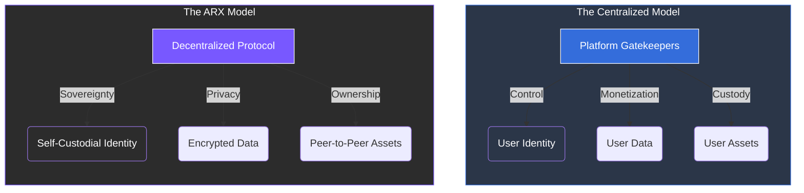

# 1.1 Centralization of the Internet

Over the past two decades, the internet has evolved from an open, community-driven network into an environment dominated by **centralized platforms**. These corporations control how people communicate, share data, and transact.

### The Structural Imbalance
While this growth connected billions, it created a fundamental friction: **user data and privacy became the price of participation.** This shift toward centralization has led to three primary systemic issues:

* **Loss of Autonomy:** Decisions about data usage and account access are made by platforms, not users.
* **Censorship:** Centralized gatekeepers have the power to restrict or remove content and users at will.
* **Dependency on Intermediaries:** Users rely on third parties for every digital interaction, from identity verification to financial transfers.

---

### The ARX Mission
ARX is built to reverse this trend by decentralizing **communication**, **identity**, and **financial tools**, ensuring users regain absolute ownership of their digital presence.

 
Regaining Ownership By removing the middleman, ARX transitions the internet from a "Platform-as-a-Service" model to a 
"User-as-an-Owner" model. 
