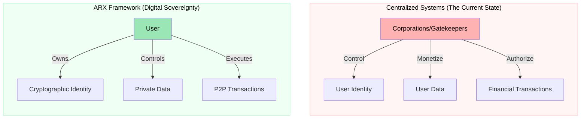

# 1.1 Centralization of the Internet

Over the past two decades, the internet has evolved from an open, community-driven network into an environment dominated by centralized platforms. While this growth connected billions, it created a structural imbalance: **user data and privacy became the price of participation.**

### The Cost of the Current Model
The dominance of centralized corporations has led to several critical vulnerabilities in our digital lives:

* **Loss of Autonomy:** Platforms control the rules, leaving users with no say in how their digital presence is managed.
* **Censorship:** Centralized entities act as gatekeepers, with the power to restrict access or silence voices at will.
* **Intermediary Dependency:** Users are forced to rely on third parties to verify their identity and manage their assets.

---

### The ARX Mission
ARX is built to reverse this trend by decentralizing the core pillars of the internet. By returning ownership to the user, we shift the power dynamic back to the individual.

 
Restoring Ownership By integrating communication, identity, and financial tools into a single decentralized 
infrastructure, ARX ensures that users regain full control over their digital footprint. 

