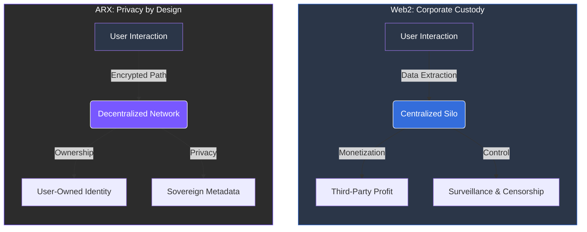

# 1.2 The Price of Convenience

Most Web2 services operate on a model of **data extraction**. Every message, click, and connection generates metadata that is stored, analyzed, and monetized.

### The Hidden Cost of "Free"
In the current internet ecosystem, users pay for “free” services with their **privacy**, while their digital identities remain under strict **corporate custody**. This dependency model has led to systemic failures:

* **Data Breaches:** Single points of failure exposing millions of records.
* **Surveillance Misuse:** Unauthorized tracking of user behavior and intent.
* **Restrictions on Expression:** Arbitrary censorship by centralized gatekeepers.

---

### Breaking the Dependency
ARX rejects the trade-off between usability and security. We provide the same convenience of modern platforms without compromising individual control.

 
The Imbalance When your identity is managed by a corporation, your access to the digital world is a permission, not a 
right. ARX restores that right through architecture. 

