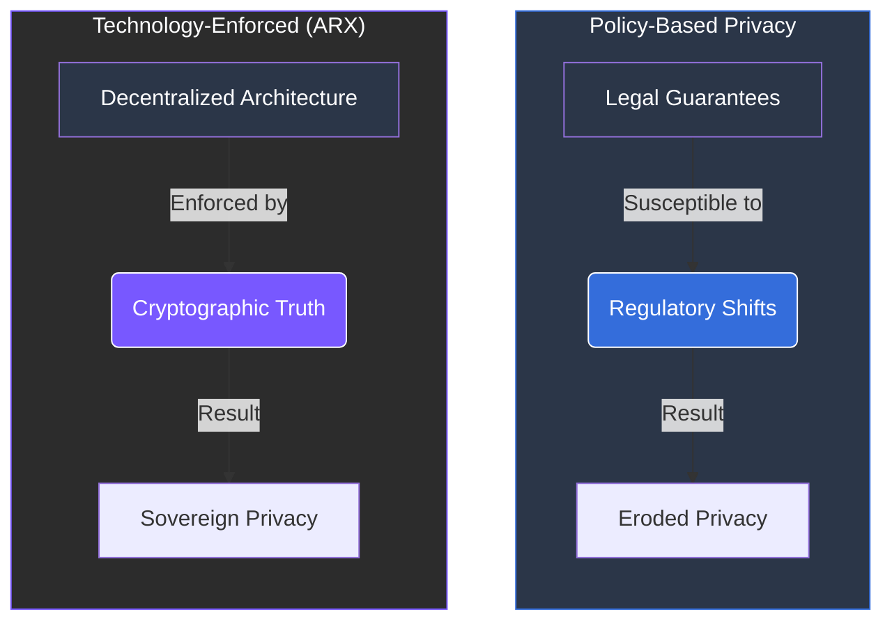

# 1.3 Regulatory and Social Shifts

The regulatory and social environment for digital communication is shifting rapidly. Governments, international organizations, and advocacy groups are redefining the limits between **privacy**, **surveillance**, and **public safety**.

### The "Chat Control" Precedent
One of the most controversial initiatives is the proposed European **“Chat Control Regulation.”** Designed to combat child sexual abuse, this law would require messaging platforms to scan private messages, images, and videos *before* encryption to detect prohibited content.


**The Threat to Encryption**
This proposal signals a broader trend: regulators are increasingly willing to weaken or bypass **End-to-End Encryption (E2EE)** in the name of security.


---

### Privacy Under Pressure
The call for "lawful access mechanisms" by bodies such as **Europol** has created a sharp divide in the digital rights landscape:

* **Law Enforcement:** Advocacy for technical access to encrypted communications for security purposes.
* **Privacy Advocates:** Groups like the **EDPS** (European Data Protection Supervisor) warn that these mechanisms fundamentally compromise digital trust and personal data security for everyone.

### Architecture as the Final Defense
The tension between regulatory control and individual privacy has reached a turning point. It is becoming clear that privacy can no longer rely on legal guarantees alone—**it must be enforced through technology itself.**

 
The Foundation of ARX This reality necessitates privacy-focused, decentralized systems that preserve user rights 
through architecture rather than policy. 
