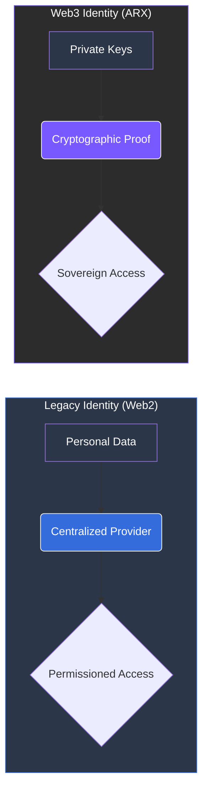

# 1.4 Rise of Web3 Identity

Web3 infrastructure introduces a paradigm where ownership and identity are verifiable without being centralized. By combining **decentralized networks**, **self-custodial wallets**, and **programmable smart contracts**, Web3 enables individuals to manage their digital presence directly—without intermediaries.

### The Shift to Cryptographic Authentication
In this model, traditional personal identifiers (emails, phone numbers) are replaced by **cryptographic credentials**.

* **Privacy-Preserving Verification:** Transactions, communications, and governance actions are verified on-chain without exposing private data.
* **Pseudonymous Accountability:** This framework bridges the gap between anonymity and accountability. Users remain pseudonymous while participating in verifiable, rule-based systems.

---

### From Terms of Service to Design
Web3 identity ensures that privacy is no longer a negotiation through a "Terms of Service" agreement, but a fundamental property embedded into the **design of the network**.

 
Technological Sovereignty This shift marks the transition from regulatory dependence to technological sovereignty, 
setting the stage for platforms built around self-custody, encryption, and community governance. 
