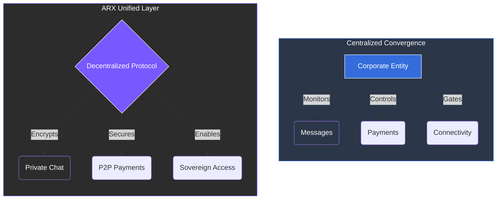

# 1.5 Convergence of Communication, Payments, and Connectivity

Digital life has traditionally been divided into three parallel domains: **communication**, **financial interaction**, and **network access**. Historically, these developed in isolation, each governed by separate centralized infrastructures.

### The Fragmented Landscape
Users currently maintain a disjointed digital existence, requiring separate accounts and trust relationships for basic actions:
* **Messaging Platforms:** Control identity and social interaction.
* **Payment Processors:** Manage the transfer of value.
* **Service Providers:** Govern physical and digital connectivity.

---

### The Risk of Centralized Integration
In recent years, these boundaries have begun to blur as platforms bundle services (e.g., messaging apps adding payments or VPNs). However, when this convergence happens under **centralized ownership**, it creates significant systemic risks:


**Amplified Vulnerabilities**
* **Expanded Surveillance:** Every new integration increases the attack surface for data collection.
* **Total Identity Tracking:** A single corporation gains a 360-degree view of your social, financial, and network activity.
* **Persistent Custody:** Transactions remain custodial, and connectivity remains dependent on centralized gateways.
  

### The ARX Unified Layer
The next generation of digital platforms must integrate these layers without replicating the surveillance and dependency of the old model.

The Turning Point: User expectations have shifted. The goal is to message, pay, and connect within one trusted 
environment—privately, securely, and without sacrificing control.
