# 1 Background & Motivation

The internet has entered a **critical transition period**. Centralized systems dominate how people communicate, transact, and connect—but at the cost of privacy, ownership, and autonomy.


**The ARX Solution**
ARX is built to address this imbalance by combining **cryptographic identity**, **decentralized communication**, and **blockchain-based incentives** to create a network where users own their data, assets, and connectivity.


---

### Context and Objectives

This section outlines the driving forces behind the ARX ecosystem:

* **The Impact of Centralization:** How monolithic platforms reshaped the internet into extractive ecosystems.
* **Privacy & Compliance:** The converging path where privacy technology meets global regulatory standards.
* **Digital Sovereignty:** How Web3 frameworks enable users to reclaim their fundamental digital rights.

### The ARX Architecture Shift

```mermaid
graph LR
    %% Background container styling
    subgraph ARX_Framework ["ARX: Reclaiming Control"]
        direction LR
        A[Centralized Systems] -->|Lack of Privacy| B(The Imbalance)
        B -->|ARX Architecture| C{Digital Sovereignty}
        C --> D[User-Owned Data]
        C --> E[User-Owned Assets]
        C --> F[Native Connectivity]
    end

    %% Visual Styling using requested palette
    style ARX_Framework fill:#2B3648,stroke:#7858ff,stroke-width:2px,color:#fefeff
    style A fill:#2c2c2c,stroke:#346ddb,color:#fefeff
    style B fill:#2c2c2c,stroke:#
```

