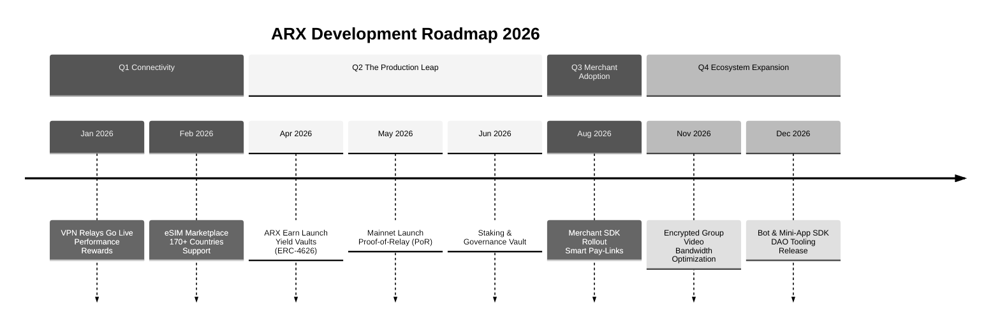

# 10.1 Development Timeline

The ARX roadmap outlines the path from a foundational messaging protocol to a comprehensive, decentralized digital economy. Following the successful **Token Generation Event (TGE)** in late 2025, the focus for 2026 shifts toward service activation, ecosystem expansion, and the final transition to a production-grade Mainnet.

### 2024 – 2025: Foundation & Integration
* **2024 | MVP Inception:** Development of the early encrypted messenger prototype and selection of the high-performance PoS chain for the settlement layer.
* **Jan 2025 | Messaging Layer Migration:** Transition to **XMTP** for decentralized message transport, while retaining **Signal’s X3DH** and Double Ratchet protocols for end-to-end encryption.
* **May 2025 | Wallet Alpha:** Launch of the internal multi-chain wallet, supporting swaps and integrated on/off-ramps directly within the chat interface.
* **Sep 2025 | Public App Launch:** Release of the ARX application, realizing the "Speak, Pay, Connect" unified experience.
* **Dec 2025 | TGE & Crypto Card:** The formal launch of the ARX token and the introduction of the regional fiat-bridge metal cards.

---

### 2026: The Year of Utility
As we move through 2026, ARX activates its core utility modules, transforming the network into a self-sustaining privacy economy.

| **Date** | **Milestone** | **Impact** |
| :--- | :--- | :--- |
| **Jan 2026** | **VPN Node Activation** | **Network Launch:** Validator-operated VPN relays go live, offering decentralized privacy. |
| **Feb 2026** | **eSIM Marketplace** | **Connectivity:** Launch of global data packages via 1Global integration in 170+ countries. |
| **Apr 2026** | **ARX Earn (ERC-4626)** | **Finance:** Deployment of yield-bearing vaults for stablecoins (USDC/USDT). |
| **May 2026** | **Mainnet Production** | **Consensus:** Official transition to full production with Proof-of-Relay (PoR) verification. |
| **Jun 2026** | **Staking Vault** | **Governance:** Advanced yield aggregation and governance participation interface. |
| **Aug 2026** | **Merchant SDK** | **Adoption:** Rollout of Pay-Links for B2C and P2P merchant transactions. |
| **Nov 2026** | **Multimedia Overhaul** | **Features:** End-to-end encrypted group video and voice calls with relay support. |
| **Dec 2026** | **Bot & Mini-App SDK** | **Expansion:** Full developer toolkit for automation and 3rd party dApp integration. |


**Current Status: Q1 2026**
Following the TGE and Crypto Card launch, the network is currently focused on the global rollout of **VPN Nodes** and the **eSIM Marketplace**. This marks the transition from "Experimental" to "Utility-Driven" growth.



**Mainnet Readiness**
The upcoming May 2026 Mainnet launch represents the final technical milestone in our decentralization journey, moving from foundation-supported consensus to a fully autonomous Proof-of-Relay network.
