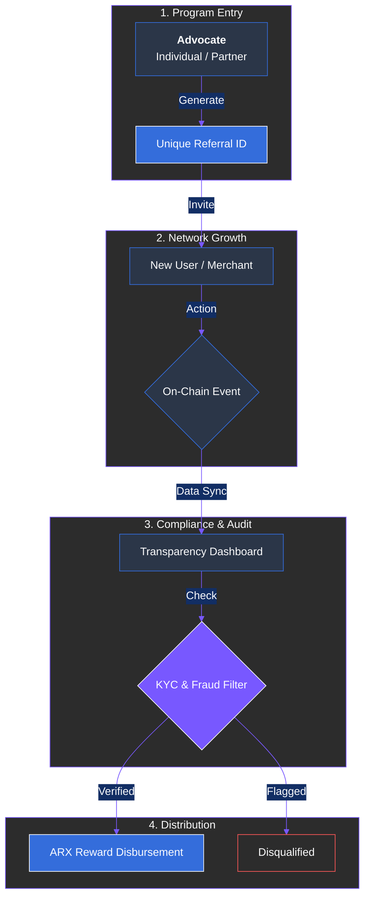

# 12.2 Affiliate and Referral Growth Program

Partnerships extend beyond corporate alliances to include individuals and communities that help expand the ARX ecosystem. The **Affiliate and Referral Growth Program** is a cornerstone of ARX’s collaborative expansion model, rewarding both strategic partners and individual advocates who contribute to the network's vitality.

### Program Objectives

* **Transparent Contribution Tracking:** Each referral or partnership activity is monitored through on-chain or dashboard-based identifiers, ensuring 100% traceability and eliminating data manipulation.
* **Community-Driven Growth:** Rather than relying on centralized marketing agencies, ARX channels resources directly to its community, rewarding organic outreach and authentic participation.
* **Partnership Scalability:** The framework supports referral links for individuals, influencer programs, venture partners, and node operators, creating a single unified incentive layer.

### Technical Framework

The program is built on a foundation of accountability and compliance:

* **On-Chain Tracking:** Every referral event is registered via a smart contract or integrated dashboard to maintain a permanent, auditable record.
* **Tiered Structure:** Reward tiers are dynamically adjusted based on the participant’s role—whether they are an individual referrer, a validator, or an institutional affiliate.
* **Verified Reward Distribution:** Rewards are paid in ARX tokens from the **Community Growth Pool**. Issuance occurs only after rigorous verification and KYC clearance to ensure ecosystem integrity.

---

### Key Use Cases

1. **Token Sale Phase:** Early participants receive unique IDs. Verified referrals earn a reward of **3–5%** of the referred participant’s contribution, credited after the TGE.
2. **Ecosystem Expansion:** Post-launch, the logic evolves to onboard new merchants and developers. Referrers earn incentives as their partners contribute to network volume or governance.
3. **Strategic B2B Partnerships:** Institutional partners can integrate referral APIs into their own platforms for joint acquisition campaigns and co-marketing initiatives.


**Compliance First**
The program is meticulously designed to comply with **MiCA** and **FINMA** requirements. It operates strictly as a marketing incentive framework, ensuring it is never classified as an investment or yield-bearing product.



**Transparency & Reporting**
All referral-based token flows are disclosed publicly through regular **DAO Transparency Reports**, ensuring the community can verify that allocations remain within the defined tokenomics boundaries.
