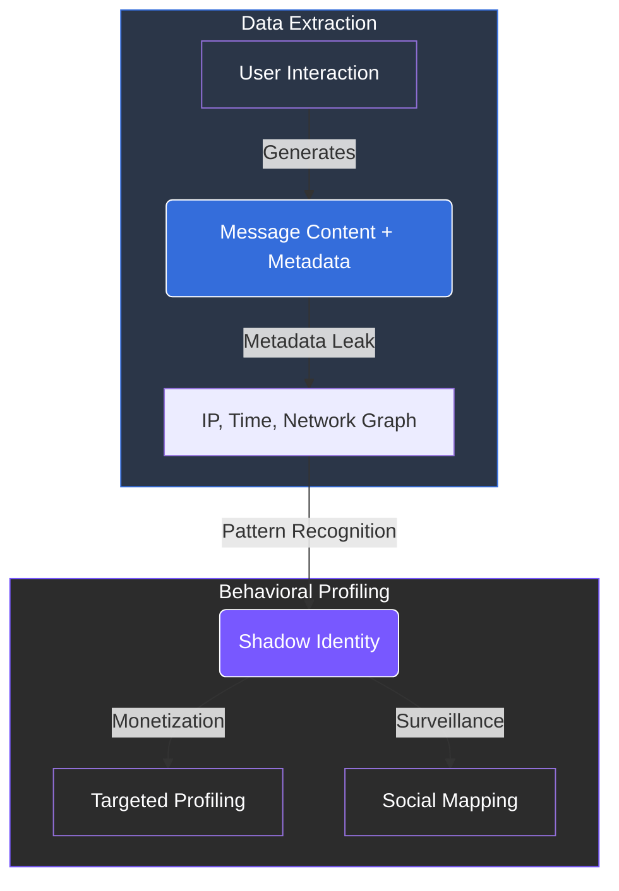

# 2.1 The Privacy Collapse

Personal information has become the default fuel of the digital economy. Most modern applications are designed to gather data not just for functionality, but to sustain extractive **business models**.

### The Metadata Trap
Even when the content of a message is protected by encryption, the "digital exhaust" or **metadata** remains exposed. This includes:
* **Identities:** Who you are communicating with.
* **Frequency:** How often and at what times you interact.
* **Technical Footprints:** IP addresses, device fingerprints, and location data.


**The Behavioral Mirror**
Individually, these data points seem trivial. When aggregated, they allow third parties to reconstruct behavioral patterns, personal networks, and daily habits with **remarkable precision**.


---

### Normalized Surveillance
This constant extraction has shifted surveillance from an exception to a fundamental **feature** of digital life. Users can no longer participate in the modern economy without leaving a detailed behavioral trail that is:
1.  **Monetized** by advertisers.
2.  **Analyzed** by platforms to predict future behavior.
3.  **Shared** with third-party brokers without explicit user consent.

### Regulatory Encroachment: The "Chat Control" Factor
The erosion of privacy is further accelerated by regulatory shifts like the **European “Chat Control” initiative**.

* **The Mechanism:** Proposed scanning of private messages *before* encryption.
* **The Risk:** Once a technical "backdoor" is created for public safety, it creates a permanent vulnerability that can be expanded or repurposed for broader monitoring.

 
**A Systemic Failure Privacy** erosion is not just a commercial nuisance; it is a systemic threat. It undermines the 
foundations of **trust, security, and personal freedom** that the internet was originally meant to guarantee. 
