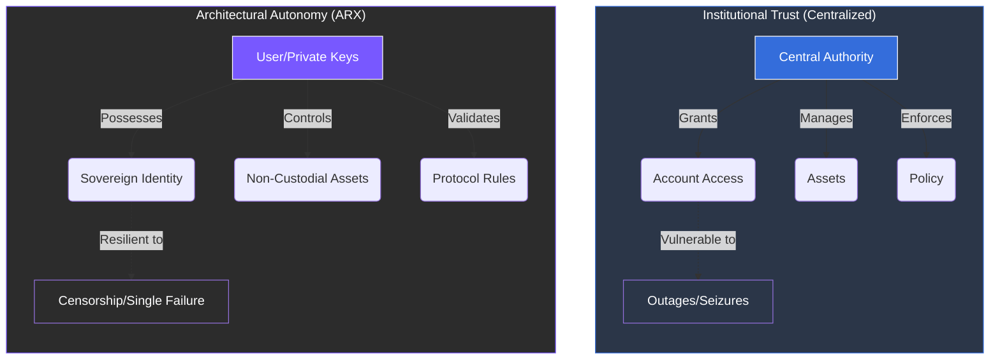

# 2.2 The Control Problem

Centralized systems concentrate both power and responsibility in the hands of a few operators. While this structure creates operational efficiency and rapid deployment, it fundamentally eliminates **systemic resilience**.

### The Vulnerability of Single Points of Failure
When a single provider controls access, the entire network becomes fragile. An administrative decision, a technical outage, or a shift in corporate policy can disconnect millions of users instantly.

* **Administrative Risk:** Platforms can remove content or entire communities without due process or transparency.
* **Geopolitical Compulsion:** Governments can compel operators to block, filter, or hand over information, turning a service provider into a tool of state policy.
* **Technical Fragility:** Large-scale outages at major cloud providers (e.g., AWS or Azure) have historically paralyzed global services, from banking to healthcare, in a "domino effect."

---

### Fragility in Financial Systems
The control problem is most acute in the financial sector. Custodial wallets, payment processors, and centralized exchanges manage funds *on behalf* of users, but those users have no technical claim to the underlying assets.


**The Custodial Trap**
Users rely on **institutional trust** rather than **technical proof**. This means:
1.  **Compliance Freezes:** Accounts can be frozen with no notice due to shifting regulations or automated flags.
2.  **Geopolitical De-platforming:** Access to digital payments can be suspended as a means of political or economic influence.
3.  **Liquidity Risk:** Users are at the mercy of the intermediary's solvency and operational uptime.
    

### Distributed Trust vs. Institutional Trust
Modern infrastructure demands a move from "revocable privileges" to **absolute digital rights**.

 
**The ARX Objective** By replacing intermediaries with decentralized protocols, ARX ensures that access to essential 
services is a **technical guarantee**, not a permission that can be revoked. 
