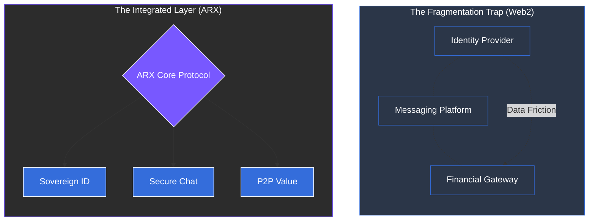

# 2.3 The Fragmentation Trap

Digital life is currently divided among countless isolated services that lack interoperability. Identity, communication, and payments each operate within their own "walled gardens," governed by separate technical standards and legal frameworks.

### The Problem of Disconnected Silos
The digital landscape is split across three primary verticals that do not communicate with one another:
* **Identity:** Managed by centralized authentication providers (Google, Apple, etc.).
* **Communication:** Controlled by siloed messaging platforms.
* **Payments:** Governed by closed financial gateways and banks.

---

### The Burden on Users and Organizations
This lack of a unified framework creates a friction-heavy experience that compromises security and efficiency:

| For Individuals | For Organizations |
| :--- | :--- |
| **Account Fatigue:** Juggling dozens of passwords and MFA methods. | **Operational Inefficiency:** Managing fragmented data across multiple vendors. |
| **Data Exposure:** Every new registration is a fresh point of potential data leakage. | **Duplicated Costs:** Paying for overlapping infrastructure and compliance tools. |
| **Lack of Portability:** Identity and social graphs are trapped within single platforms. | **Inconsistent Security:** Maintaining a cohesive security posture across disconnected tools. |


**The Trust Gap**
The absence of a shared trust framework between communication and financial systems makes true peer-to-peer interaction nearly impossible without a third-party intermediary.


---

### Transitioning to a Unified Framework
ARX aims to break these silos by providing a single, decentralized infrastructure where identity, interaction, and value transfer are natively integrated.

**The Result**: Moving away from disconnected silos toward a unified digital identity that is secure, portable, 
and entirely self-controlled.