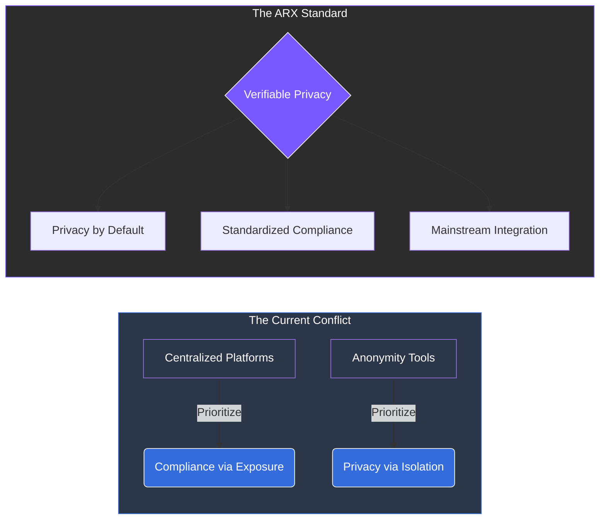

# 2.4 The Compliance Conflict

The global regulatory environment is expanding in both scope and intensity. Legislators demand transparency and mechanisms for "lawful access" to data, while users and advocacy groups insist on **privacy, anonymity, and data minimization**.

### The Zero-Sum Trap

Historically, these two objectives have been treated as mutually exclusive. This misalignment forces digital platforms into one of two suboptimal paths:

1. **The Web2 Approach (Over-Collection):** Platforms meet regulatory demands by storing massive amounts of user data. This ensures compliance but creates a "honeypot" for breaches, leaks, and systemic misuse.
2. **The Shadow Approach (Avoidance):** Privacy tools that ignore regulation entirely. While they protect users, they are often excluded from mainstream financial systems and communication networks due to lack of oversight.


**The Resulting Stagnation** This conflict leaves both sides dissatisfied. Regulators struggle with inconsistent enforcement, while users are forced to choose between **excessive surveillance** or **digital exclusion**.


***

### Bridging the Gap through Architecture

ARX addresses this conflict not through policy, but through **cryptographic truth**. By using advanced technology, we can provide verifiability without compromising the underlying personal data.


**A New Shared Standard** The lack of a shared standard for **verifiable yet private interaction** is the final barrier to a balanced digital economy. ARX is built to be that standard—enabling a network that is both legally sustainable and fundamentally private.

