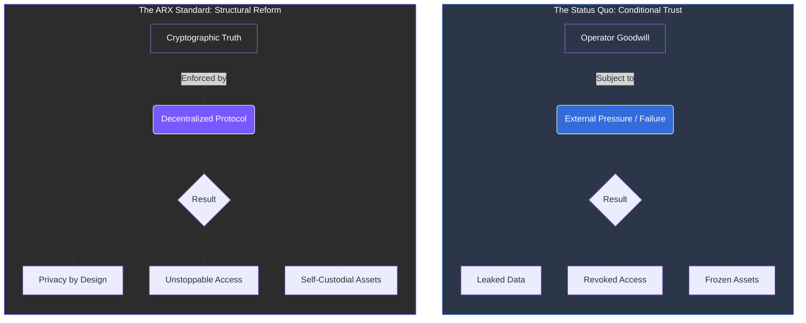

# 2.5 Real-World Impact

The structural weaknesses of the current internet are not theoretical—their practical effects are visible across nearly every sector, manifesting as a series of recurring failures.

### Systemic Failures in the Modern Web

* **Data Breaches:** Repeated leaks from major service providers have compromised billions of records, exposing personal messages, credentials, and sensitive financial data.
* **Censorship and Access Restrictions:** Messaging platforms and social networks are frequently blocked or throttled during political events or crises, silencing communication when it is needed most.
* **Custodial Failures:** Users have lost access to funds and accounts when payment processors or exchanges suspended operations due to regulatory pressure or financial instability.

---

### The Pattern of Dependency
These incidents reveal a consistent and troubling pattern: users are entirely dependent on intermediaries that control both the infrastructure and the policy governing its use.

**The Need for Structural Reform**
The internet, once envisioned as a resilient network, now functions as a set of walled gardens governed by private and 
governmental interests.

 
**The Reality of Conditional Rights** Without structural reform, your digital presence remains fragile:
 * **Privacy remains** conditional.
 * **Access remains** revocable.
 * **Participation** remains unequal. 


Trust in current systems relies on the **goodwill of operators**; ARX shifts that trust to **mathematical certainty**.