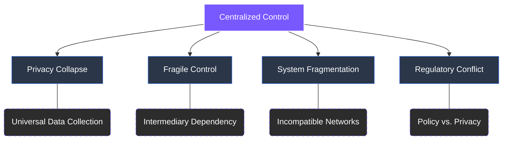

# 2 Problem Definition

The digital economy operates on an infrastructure that prioritizes **convenience over sovereignty**. A small group of corporations control the systems that enable communication, data exchange, and payments. Users depend on these intermediaries for access, identity verification, and transaction processing.


**The Core Trade-off**
In exchange for "free" access, users surrender visibility into data usage and lose the ability to operate independently of centralized oversight.


---

### The Four Structural Weaknesses
This concentration of control has created four fundamental failures that now define the modern internet:

1.  **Privacy Collapse:** Data collection has become universal and unavoidable.
2.  **Fragile Control:** Power resides entirely in centralized intermediaries, not the users.
3.  **System Fragmentation:** The digital landscape is split across incompatible networks and providers.
4.  **Regulatory Conflict:** A permanent tension exists between government mandates and individual privacy.

### Visualizing the Problem Space

Each of these failures contributes to the same ultimate outcome: ***users no longer own the digital environment they rely on***.