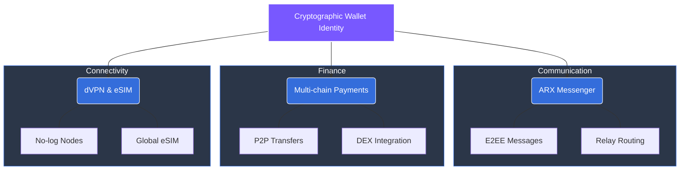

# 3.1 Unified Private Network

At the core of ARX is the unified private network, which merges **communication**, **payments**, and **connectivity** into a single, cohesive identity layer. Every interaction within the ecosystem is anchored by a cryptographic wallet that serves as both a secure authentication method and a versatile payment mechanism.

### The Three Functional Layers

ARX eliminates the need for separate, siloed applications by integrating the following services under one roof:

#### 💬 Communication
The ARX messenger provides **End-to-End Encrypted (E2EE)** communication for direct messages, group chats, and media sharing.
* **Privacy-First Routing:** Distributed relays obscure metadata (sender/receiver info).
* **Zero Storage:** No message history or interaction data is stored centrally.

#### 💳 Payments
A built-in multi-chain wallet enables fast, peer-to-peer transfers, asset swaps, and merchant payments.
* **Self-Custody:** Balances are managed directly on the user’s device.
* **Versatility:** Supports QR-based transactions and direct integrations with decentralized exchanges (DEXs).

#### 🌐 Connectivity
ARX extends privacy to the network access layer, ensuring your "digital pipes" are as secure as your messages.
* **dVPN:** A decentralized VPN layer using validator nodes with no-log endpoints.
* **Private eSIM:** Powered by **1GLOBAL** infrastructure, enabling mobile connectivity across multiple regions without traditional KYC-heavy registration.

---

### One Identity, Zero Friction
All three layers operate under a single **wallet-based identity**.


**Eliminating the Data Trail**
By removing the need for phone numbers, emails, or external accounts, ARX ensures users retain total control of their data while moving seamlessly across all services.


