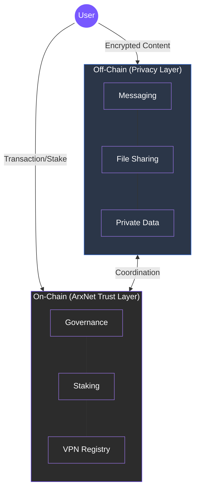

# 3.2 On-Chain Trust and Off-Chain Privacy

ARX is designed around the principle that privacy and transparency are not opposites. It separates **interaction** from **coordination** so that personal data remains private while system logic remains verifiable.

### The Hybrid Architecture

To achieve both high performance and absolute privacy, ARX splits its operations into two distinct layers:

#### 🔒 Off-chain Privacy
All communication, file transfers, and personal information remain encrypted and are transmitted through peer-to-peer channels.
* **Zero-Knowledge Transmission:** Nothing is written to the blockchain.
* **Metadata Protection:** Relay nodes only see encrypted payloads and routing identifiers, preventing metadata reconstruction or traffic analysis.

#### ⛓️ On-chain Trust
Economic coordination and validator management occur transparently on **ArxNet**, an EVM-compatible Proof-of-Stake (PoS) chain.
* **Accountability:** Governance, staking, and rewards are publicly auditable.
* **Network Integrity:** Ensures performance and decision-making are verifiable by all participants.

---

### Layer Comparison

| Layer | Functionality | Privacy Level | Verifiability |
| :--- | :--- | :--- | :--- |
| **Off-chain** | Messaging, file sharing, identity | **High** (Encrypted) | Low (Ephemeral) |
| **On-chain (ArxNet)** | Staking, governance, rewards, VPN registry | **Transparent** | **High** (Auditable) |

---

### Why a Hybrid Model?


**The Resulting Balance** By separating these layers, ARX ensures that **performance** is high (avoiding blockchain congestion), **confidentiality** is absolute (data stays local), and **integrity** is maintained (governance is public).

