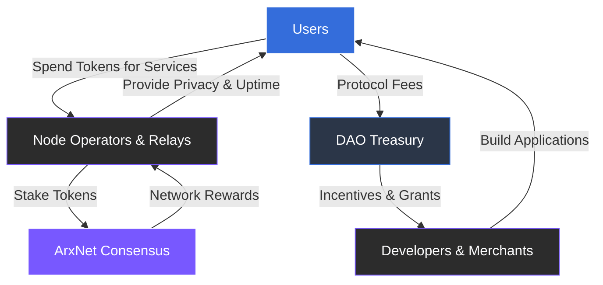

# 3.3 Self-Sustaining Token Economy

The ARX ecosystem is powered by a utility token that links all network participants through shared economic incentives. The token underpins **payments**, **staking**, **governance**, and **infrastructure rewards**.

### Token Utility

The token serves distinct roles for different participants within the network:

* **Users:** Spend tokens to access premium features, such as the decentralized VPN and eSIM services, or to facilitate peer-to-peer payments and microtransactions.
* **Validators and Relays:** Stake tokens to secure the network. They earn rewards proportional to their reliability, uptime, and contribution to network privacy.
* **Developers and Merchants:** Integrate ARX infrastructure into their own platforms and receive ecosystem incentives for maintaining high-quality applications or payment gateways.

---

### The Economic Cycle

ARX operates as a **closed economic loop** where value is generated by the utility and health of the network rather than the extraction of user data.


**Value-Driven Privacy**
By eliminating reliance on advertising or data sales, ARX ensures that privacy and stability are no longer "costs"—they are **measurable, rewarded outcomes** of the network's operation.


---

> [!IMPORTANT]
> This model aligns the interests of all stakeholders. When the network is secure and private, its utility increases, benefiting the entire ecosystem through a transparent and sustainable economic framework.