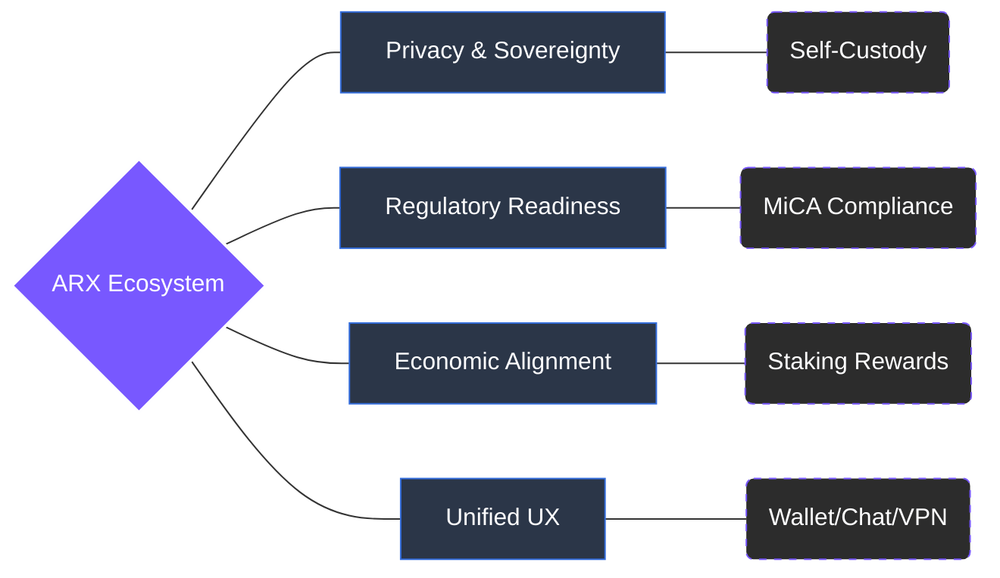

# 3.4 Competitive Edge and System Outcomes

ARX integrates architectural innovation, economic alignment, and regulatory readiness into one cohesive system. It bridges the gap between Web2 efficiency and Web3 sovereignty, achieving what other communication and privacy projects have not: scalability with compliance, and decentralization without complexity.

### Comparative Advantage

| **Category** | **ARX Advantage** | **Traditional or Web3 Alternative** |
| ------------------ | --------------------------------------------------------- | ------------------------------------------------- |
| **Identity** | Wallet-based authentication without phone or email        | Centralized accounts                              |
| **Privacy model** | Off-chain encrypted communication and metadata protection | Server-stored metadata and centralized routing    |
| **Economic model** | Token incentives for reliability and uptime               | Ad-based, subscription-based, or donation funding |
| **Governance** | On-chain voting and DAO treasury management               | Centralized decision-making                       |
| **Compliance** | Tiered KYC and MiCA-ready architecture                    | Undefined or reactive frameworks                  |
| **Integration** | Unified messenger, wallet, and VPN in one platform        | Fragmented multi-app experience                   |

---

### System Outcomes

This integrated approach results in a system that is:

* **Private by design**: Encryption and self-custody ensure that no metadata or identifiers are exposed.
* **Resilient by structure**: Distributed relays and validator nodes prevent censorship and outages.
* **Transparent by governance**: Network rules, staking, and treasury activity are verifiable on-chain.
* **Aligned by incentives**: Participants are rewarded for maintaining uptime, privacy, and network integrity.
* **Compliant by architecture**: Technical design supports MiCA and GDPR principles without compromising privacy.


**The ARX Edge**
ARX demonstrates that privacy, ownership, and regulation can coexist in a single, self-sustaining digital infrastructure—one where users control their communication, data, and connectivity under a unified framework.
