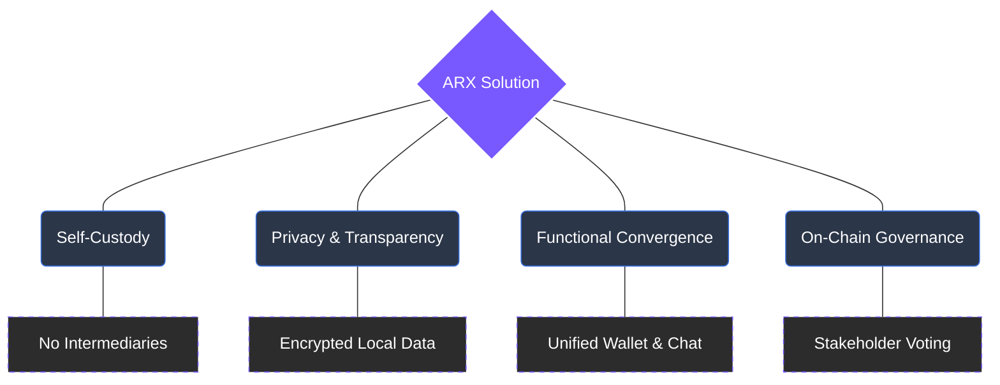

# 3 The ARX Solution

ARX is a decentralized framework designed for **digital sovereignty**. It replaces centralized layers of identity, communication, and networking with an architecture built on **cryptographic ownership** and **verifiable coordination**.

### Core Guiding Principles

The ARX platform is built on four pillars that redefine the relationship between users and the digital services they use:

1.  **Self-Custody as a Baseline:** Users control their identity and keys directly from their devices. There are no intermediaries, no "forgot password" links managed by corporations, and no external authentication systems.
2.  **Privacy without Opacity:** User data remains local and encrypted. Conversely, the coordination logic (the code that secures the network) is fully transparent, open-source, and auditable.
3.  **Functional Convergence:** ARX unifies messaging, payments, and connectivity. This allows for a seamless experience where users can transact and communicate without the friction of switching between fragmented, siloed platforms.
4.  **Governance through Participation:** The network is not a "product" managed by a board of directors; it is a protocol governed by its users through on-chain voting and staking.

---

### The Foundation of Sovereignty

ARX transitions the digital ecosystem from a model of **Corporate Control** to one of **Distributed Consensus**.


**Next Steps** The following sections describe how these core principles translate into the functional **Architecture**, **Economics**, and **Governance** models of the ARX network.

