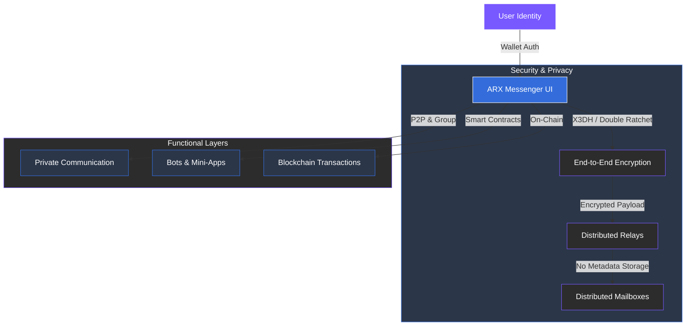

# 4.1 Communication – ARX Messenger

ARX Messenger is the core of the ecosystem and the main user interface. It enables private, secure, and censorship-resistant communication for individuals and communities.

### Core Features

* **End-to-End Encryption:** All messages utilize **X3DH** and **Double Ratchet** encryption protocols. Only the sender and recipient possess the keys to decrypt content.
* **Metadata Protection:** Distributed relays handle encrypted payloads without visibility into sender identities, recipient addresses, or timestamps.
* **Wallet-Based Login:** Eliminates the need for phone numbers or emails. Identity is purely cryptographic, verified directly through the user's wallet.
* **Groups and Channels:** Users can create private or public communities with granular moderation tools and access control.
* **Bots and Mini-Apps:** Automate complex tasks, manage DAOs, or trigger blockchain transactions directly within the chat interface.
* **Ephemeral Messages:** Optional disappearing messages and encrypted attachments provide an extra layer of operational security.
* **Offline Relay Tolerance:** Distributed mailboxes ensure reliable message delivery even when users are not simultaneously online, without relying on central servers.

---

### The Unified Interface

ARX Messenger serves as the unified interface for all ecosystem interactions. Users can communicate, initiate transactions, and access decentralized services directly within the chat environment. By combining privacy, flexibility, and blockchain connectivity, it bridges communication with financial and network functions under a single encrypted interface.


**Beyond Messaging**
Because the messenger is linked to your cryptographic identity, it becomes more than just a chat app—it is your primary portal to the decentralized economy.
