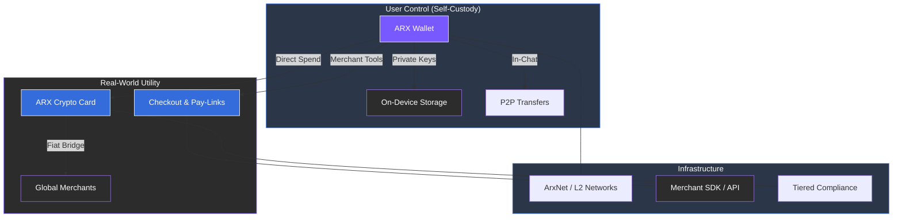

# 4.2 Fintech – Wallet, Card, Pay-Links, and Checkout

The ARX Fintech Suite connects communication with financial sovereignty. It merges a multi-chain wallet, crypto card, and checkout system into a single, self-custodial environment that allows users to send, receive, and spend digital assets seamlessly.

### ARX Wallet
* **Multi-chain Support:** Compatible with Ethereum, EVM networks, and Layer 2 solutions.
* **In-Chat Transactions:** Send or request tokens directly inside conversations.
* **Stablecoin Integration:** Facilitates everyday payments with minimal volatility.
* **Gas Abstraction:** Supports meta-transactions and fee delegation for a frictionless UX.
* **Local Key Custody:** Private keys are generated and stored on-device, never on a central server.

### ARX Crypto Card
* **Fiat Bridge:** Instant crypto-to-fiat conversion through regulated partners for global acceptance.
* **Instant Settlement:** Transactions are processed directly from the wallet balance, eliminating traditional intermediaries.
* **Tiered Verification:** Light KYC for basic access; enhanced verification for higher limits.
* **Premium Tiers:** Physical options include high-end metal, gold, and silver-backed editions.

### Pay-Links and Checkout
* **Smart Pay-Links:** Create one-click payment links with the ability to split or escrow funds.
* **QR Payments:** Instant QR code generation for in-person or event-based commerce.
* **Merchant SDK & API:** Seamlessly integrate ARX checkout into websites and marketplaces.
* **Instant Settlement:** Payments go directly to merchant wallets without custodians or delays.


**Unified Liquidity**
The Fintech vertical transforms ARX into a full-stack commerce ecosystem. By combining liquidity with usability, ARX ensures that users maintain full control over their assets while enjoying the convenience of modern banking.
