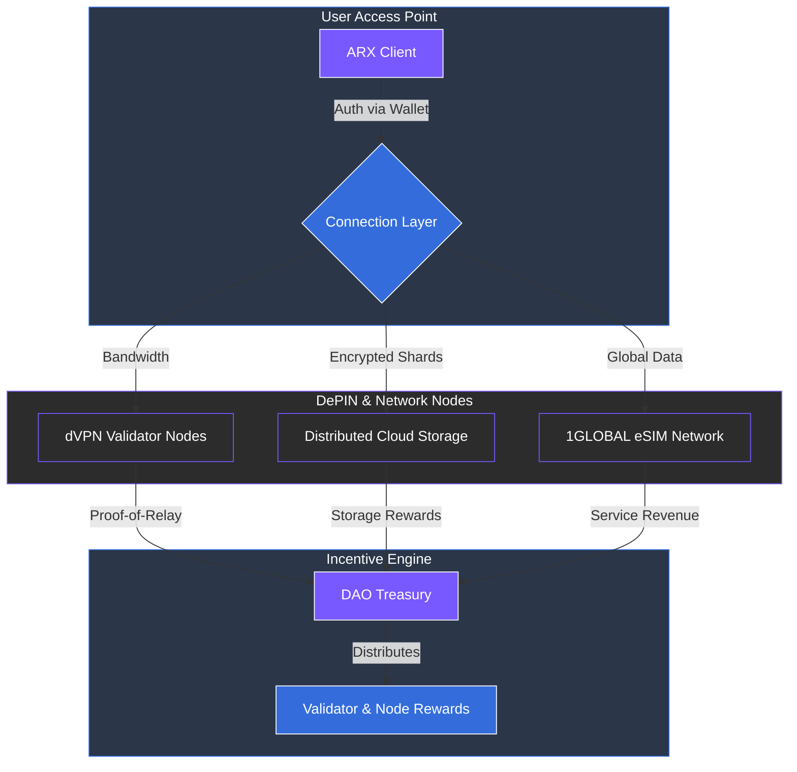

# 4.3 Connection – VPN, eSIM, and Cloud Storage

The Connection layer provides secure, private, and borderless access to global internet infrastructure. It extends ARX’s privacy architecture beyond communication and finance, ensuring data protection at the network level.

### Core Networking Features

* **Decentralized VPN (dVPN):** Validator nodes provide bandwidth and earn ARX tokens for uptime, ensuring global access and censorship resistance.
* **No Logs or Tracking:** A zero-knowledge design ensures that no connection or browsing data is ever collected, stored, or analyzed.
* **Built-in Threat Protection:** Relays filter malicious traffic, block intrusive trackers, and protect users against phishing attempts.
* **Global eSIM Marketplace:** Powered by **1GLOBAL** integration, users can activate mobile data packages directly within the app, bypassing traditional telecom intermediaries.

### Decentralized Cloud Storage (DePIN-based)

ARX integrates a distributed storage protocol where network nodes host encrypted file fragments instead of centralized servers.
* **Privacy and Control:** Files are sharded and encrypted locally. Only the user holds the cryptographic keys; no single node can reconstruct the data.
* **Performance and Reliability:** The network leverages validator and relay nodes for intelligent routing, ensuring high redundancy and fast retrieval.
* **Node Incentives:** Providers earn ARX tokens based on uptime and retrieval efficiency, contributing to the **Proof-of-Relay** economy.
* **Deep Integration:** Links seamlessly with ARX Messenger and Wallet for secure file sharing, encrypted backups, and decentralized media hosting.

---

### Sustaining the Network
Revenue from VPN, eSIM, and storage services flows directly into the **DAO Treasury** and **Validator Rewards**. This reinforces a sustainable incentive loop that connects real-world service demand with network reliability.


**Full-Stack Protection**
The Connection layer completes the ARX infrastructure stack. By integrating VPN, eSIM, and storage, ARX protects users not only at the application level but across the entire data transmission and storage chain.
