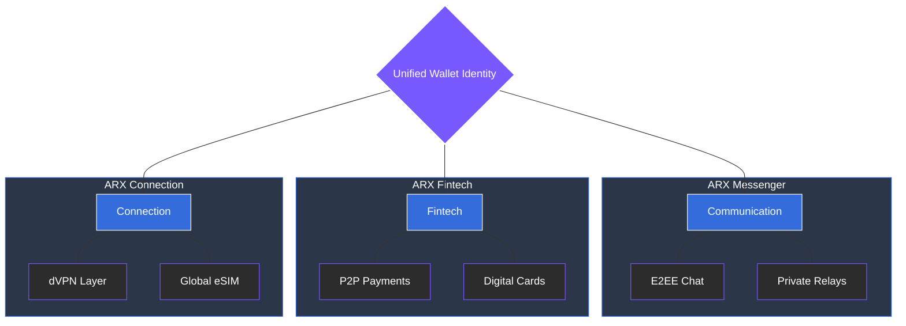

# 4 Product Overview

ARX is built around three functional verticals that together form a unified privacy and utility ecosystem. This architecture turns ARX into a complete digital environment where users can communicate, transact, and connect securely without leaving the platform.

### The Three Verticals

Each vertical operates independently but becomes exponentially more powerful when combined under one wallet-based identity:

1.  **Communication:** A secure, encrypted messenger designed for private interaction and high-stakes coordination. It removes the need for centralized metadata storage.
2.  **Fintech:** Integrated wallet, card, and payment tools that enable frictionless digital commerce, allowing users to manage assets and make payments globally.
3.  **Connection:** A decentralized VPN (dVPN) and eSIM network providing secure, borderless connectivity that bypasses traditional tracking and regional restrictions.

---

### The Unified Experience

By integrating these services, ARX eliminates the "fragmentation trap," allowing for a seamless transition between social, financial, and network activities.


**Identity as the Anchor**
While these verticals provide diverse functionalities, they are all anchored by a single cryptographic identity. This ensures that privacy is maintained across every touchpoint of the ecosystem.
