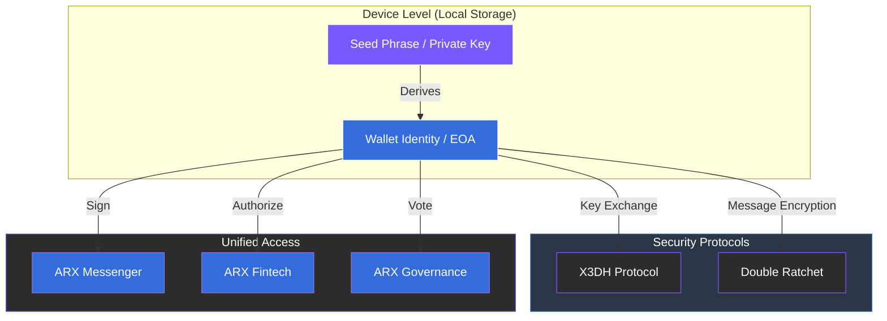

# 5.1 Identity Layer

The identity layer forms the foundation of the ARX ecosystem. Every user is represented by a cryptographic wallet that functions as both an authentication method and an encryption key. This architecture fundamentally eliminates the need for phone numbers, emails, or any centralized identifiers.

### Key Principles

* **Wallet-Based Identity:** Each user operates through an **Externally Owned Account (EOA)**. This single account authorizes both financial transactions and secure, encrypted communication.
* **Signal Protocol Integration:** ARX combines the wallet identity with the **Signal Double Ratchet** and **X3DH** protocols. This ensures industry-leading forward secrecy and absolute confidentiality.
* **Portable and Persistent Identity:** A user’s identity is not tied to a specific piece of hardware. It can be restored across multiple devices using a standard seed phrase or secure backup key.
* **Unified Access:** One identity serves all purposes. The same cryptographic proof authorizes messaging, financial payments, and voting in governance.

---

### Sovereignty by Design

This layer guarantees that the user remains the sole owner of their digital presence. There are no "admin" overrides, and no third party can revoke access to an identity that is mathematically secured on-device.


**Zero-Knowledge Authentication**
By using wallet-based login, ARX achieves "Zero-Knowledge" authentication. The network knows a valid user is present but possesses no personal data that could link that user to a real-world identity.
