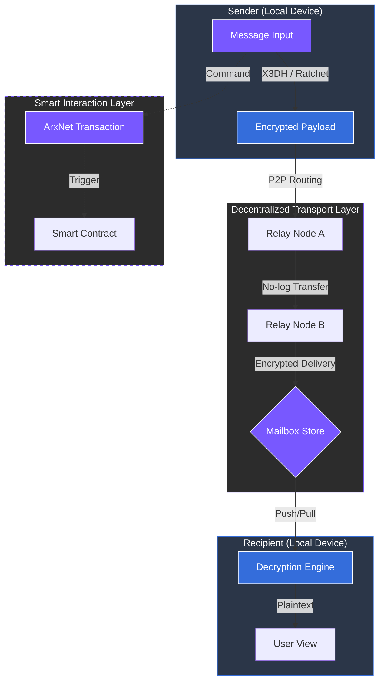

# 5.2 Messaging Layer

The messaging layer delivers private, real-time communication between users without reliance on central servers. All message content and metadata remain encrypted from the sender to the recipient, ensuring that the network operates as a neutral transport layer.

### Core Functions

* **Encrypted Payloads:** Messages and files are encrypted locally on the sender's device. This data is never stored on-chain, keeping the blockchain lightweight and the communication private.
* **Relay Nodes:** Independent relays transport encrypted data across the network. Because the data is encrypted, relays have zero visibility into the content, the sender/receiver identities, or the metadata.
* **Mailbox Architecture:** To handle asynchronous communication, ARX uses a mailbox system. This ensures message delivery even when the recipient is offline by utilizing temporary, encrypted storage that only the intended recipient can unlock.
* **Smart Interactions:** ARX Messenger is more than a chat tool; it is an execution environment. Chats can include commands for payments, smart contract triggers, or DAO voting, all executed directly through the integrated wallet.


**Decentralized Coordination**
This design provides secure and flexible communication while maintaining complete decentralization. By separating the transport of data from its storage, ARX eliminates single points of failure.
