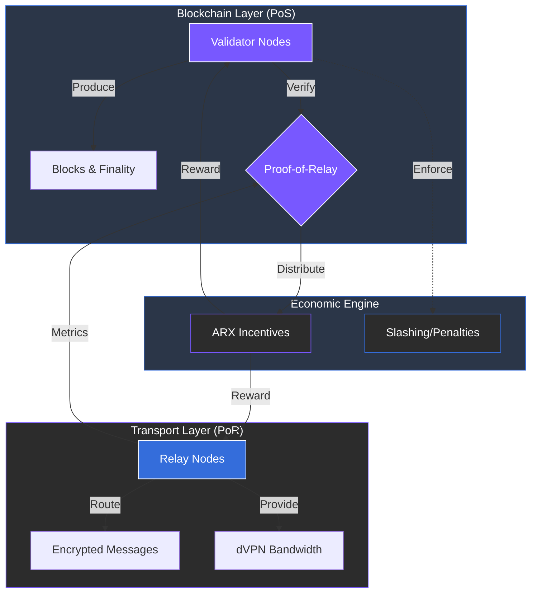

# 5.3 Network Layer

The network layer supports ARX operations through a hybrid **Proof-of-Stake (PoS)** and **Proof-of-Relay (PoR)** mechanism. This dual-consensus approach ensures both the cryptographic integrity of the blockchain and the high-performance reliability of the transport network.

### Main Components

* **Relay Nodes:** Responsible for handling encrypted message routing, VPN traffic, and high-speed data transmission. They form the backbone of the privacy-preserving transport layer.
* **Validator Nodes:** These nodes produce blocks, confirm transactions on ArxNet, and verify the performance of the relay set.
* **Proof-of-Relay (PoR):** A specialized mechanism that rewards nodes based on measurable performance metrics, including uptime, latency, and data throughput.
* **Slashing and Penalties:** To maintain network health, nodes that exhibit poor performance, downtime, or malicious behavior lose a portion of their staked tokens.
* **Interoperability:** ArxNet is EVM-compatible and supports cross-chain bridges, ensuring seamless liquidity and governance alignment with the broader Web3 ecosystem.

---

### Reward Alignment

The network layer ensures that reliability and performance are directly rewarded through verifiable contribution. By linking economic incentives to technical performance, ARX maintains a high-quality infrastructure without centralized oversight.


**Hybrid Consensus Efficiency**
By separating block production (PoS) from data routing (PoR), ARX can scale its connectivity services independently of its blockchain transaction throughput.
