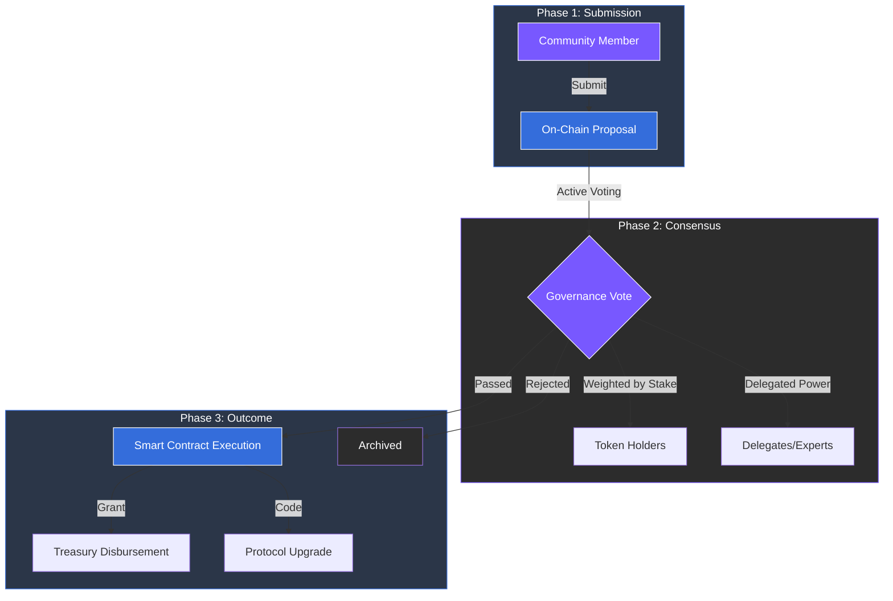

# 5.4 Governance Layer

Governance defines how ARX evolves over time through transparent, community-led processes. All proposals, votes, and fund allocations occur on-chain, ensuring that the network remains a public good rather than a corporate product.

### Key Functions

* **Proposal System:** Token holders can suggest protocol upgrades, funding initiatives, or parameter changes. This open submission process allows the network to adapt to new technical requirements or market conditions.
* **Token-Weighted Voting:** Voting power is proportional to the number of tokens held or staked. This ensures representation and allows for the delegation of votes to trusted parties or domain experts to improve decision-making efficiency.
* **Treasury Management:** The ARX DAO treasury funds ecosystem development, research, and infrastructure operations. Every transaction, grant, and payment is recorded on-chain for full public audit.
* **Transitional Safety:** During the initial phases of growth, a multisignature (multisig) oversight system is employed. This provides a safety net to prevent malicious proposals while the network transitions to full, automated decentralization.

---

### Accountability by Default

This layer guarantees transparency and accountability for every strategic and technical decision within the network. By moving governance from behind closed doors to the blockchain, ARX aligns the interests of developers, validators, and users.


**The DAO Advantage**
Decentralized governance prevents "platform capture" by any single entity. It ensures that the protocol's evolution is driven by the collective needs of the people who actually use and secure it.
