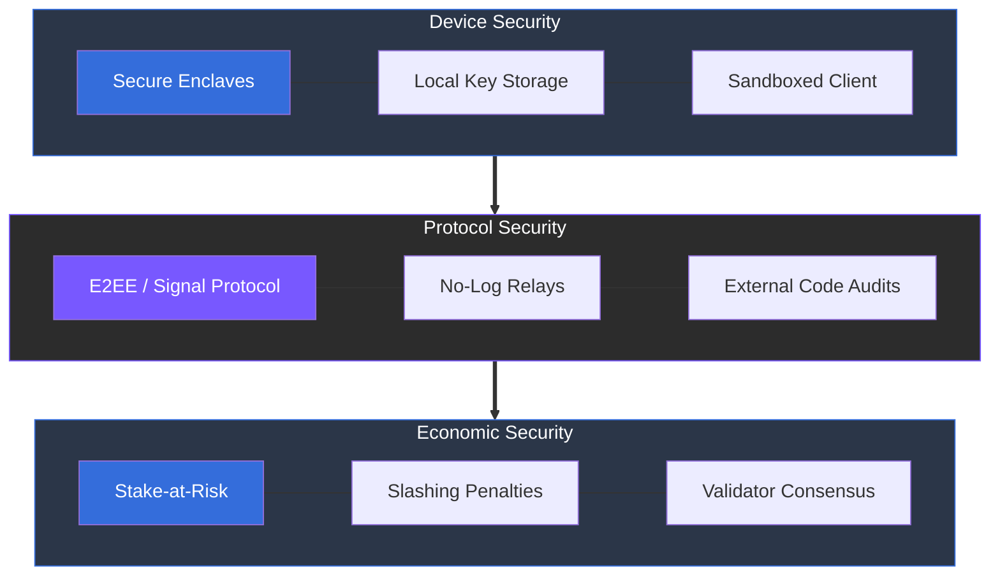

# 5.5 Security Framework

Security is integrated into every part of the ARX system. It protects communication, governance, and economic mechanisms from both technical and operational risks, ensuring that privacy and reliability are maintained at all times.

### Main Safeguards

* **End-to-End Encryption:** Ensures that only the sender and the intended recipient can access message content. Data is unreadable to anyone else, including node operators.
* **Local Key Storage:** Private keys never leave the user’s device. This "zero-trust" approach ensures that even if the network is compromised, individual user accounts remain secure.
* **Validator Integrity:** The Proof-of-Stake mechanism includes economic penalties (slashing) to discourage downtime, censorship, or any form of malicious misconduct.
* **Independent Audits:** The protocol and its underlying code undergo regular external reviews by cybersecurity firms to confirm safety and cryptographic accuracy.
* **Device Protection:** Mobile and desktop clients are designed to leverage secure enclaves, hardware security modules (HSMs), and sandboxing where available to prevent local data theft.

---

### Layered Defense Strategy

This layered security model provides a comprehensive defense-in-depth strategy, protecting the user from the application level down to the underlying economic layer.


**Security as a Foundation**
In the ARX ecosystem, security is not an add-on feature—it is the prerequisite for sovereignty. By combining cryptographic proof with economic incentives, the network creates a self-defending environment.
