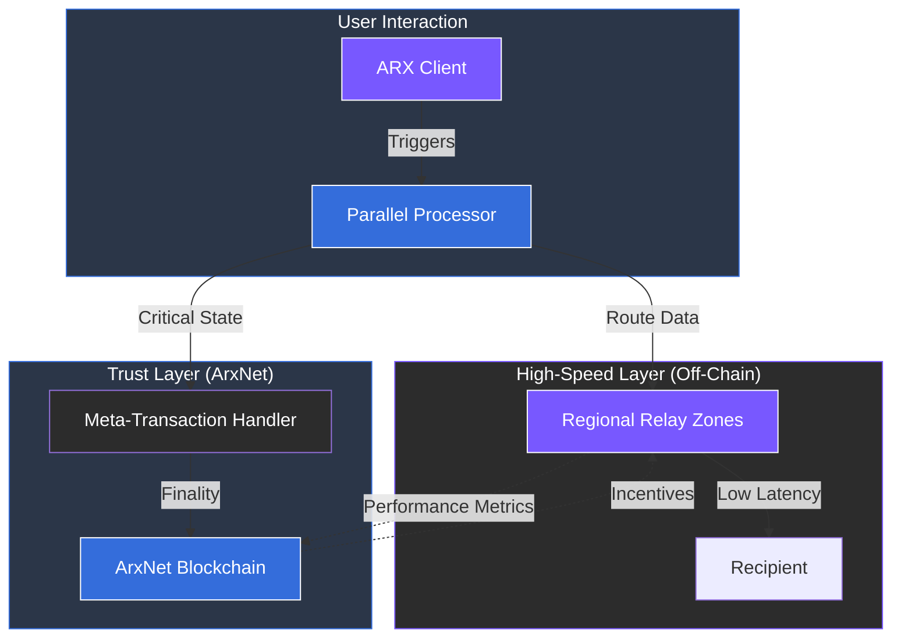

# 5.6 Scalability and Performance

ARX is designed to serve millions of users while preserving decentralization. The architecture achieves high throughput and low latency through parallel processing and strategically handled off-chain operations, ensuring the network remains responsive as it scales.

### Performance Mechanisms

* **Off-Chain Communication:** To prevent blockchain congestion, nearly all messaging and data transmission occurs off-chain. The blockchain is only utilized for critical state changes, such as identity updates or financial finality.
* **Relay Zoning:** The network utilizes regional relay clusters. By routing data through nodes physically closer to the users, ARX minimizes latency and optimizes the speed of message delivery.
* **Meta-Transactions (Gas Abstraction):** Users can interact with the blockchain without needing to hold native gas tokens. This removes a significant barrier to entry and ensures a smooth, "Web2-like" onboarding experience.
* **Parallel Routing:** Data routing and blockchain validation occur simultaneously. This asynchronous design ensures that high volumes of communication do not slow down the consensus layer.
* **Real-Time Monitoring:** Continuous system metrics track node performance and responsiveness. Nodes that fail to meet high-speed standards are automatically deprioritized by the Proof-of-Relay mechanism.

---

### The Real-Time Decentralized Experience

By decoupling high-frequency communication from low-frequency consensus, ARX provides a near real-time user experience that rivals centralized alternatives without sacrificing its decentralized core.


**Efficiency through Decoupling**
Standard blockchains often struggle with speed because every action is recorded on-chain. ARX solves this by using the blockchain as a "