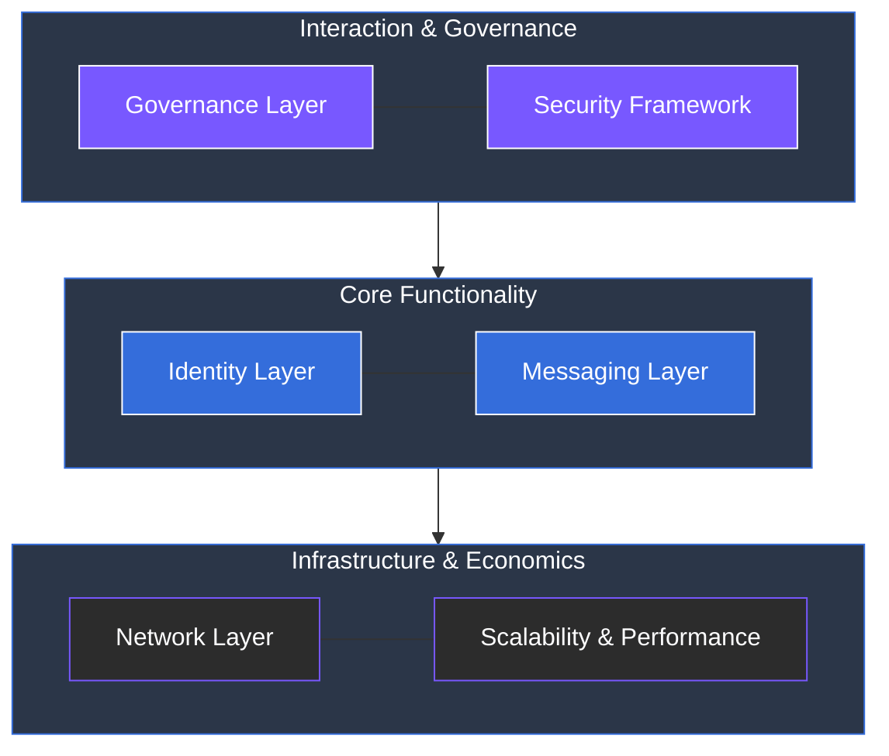

# 5 System Architecture

The ARX system architecture defines how privacy, scalability, and decentralization operate together within one framework. It connects communication, payments, and governance under a single, modular structure that ensures speed, reliability, and user sovereignty.

### The Technical Layers

Each component works independently but contributes to the overall network integrity and security across several distinct layers:

* **Identity Layer:** Establishes wallet-based user authentication and self-sovereign digital identity (SSI).
* **Messaging Layer:** Enables encrypted, off-chain communication without the need for centralized servers.
* **Network Layer:** Maintains reliability through validator and relay coordination using **Proof-of-Stake (PoS)** and **Proof-of-Relay** mechanisms.
* **Governance Layer:** Oversees decision-making, treasury control, and protocol upgrades through on-chain voting.
* **Security Framework:** Ensures protection at the device, protocol, and economic levels.
* **Scalability & Performance:** Optimizes throughput and efficiency for large-scale adoption.

---

### Structural Overview

This multi-layered approach ensures that the network remains fast enough for daily use while maintaining the cryptographic guarantees required for absolute privacy.


**Modular Resilience**
Because each layer is modular, the failure or compromise of a single non-core component does not jeopardize the integrity of the user's identity or the security of their assets.
