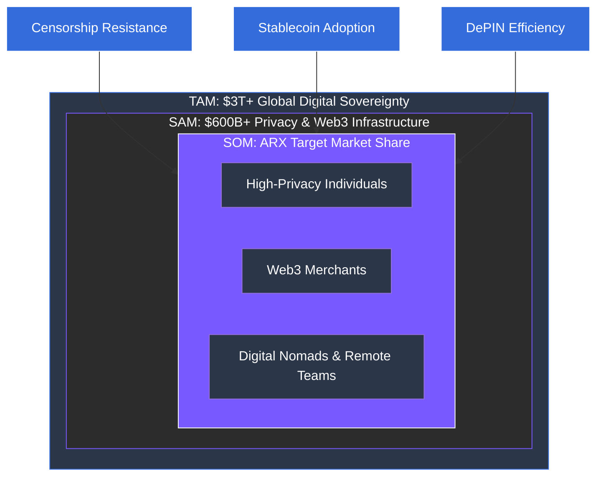

# 6.1 Market Opportunity Analysis (TAM, SAM, SOM)

The global market for private communication, digital payments, and secure connectivity is entering a phase of exponential growth in 2026. ARX operates at the convergence of three multi-billion dollar verticals, capturing value where user demand for privacy meets the necessity of global digital utility.

### Market Vertical Breakdown

| **Vertical** | **Market Size (2025-2030)** | **2026 Growth Drivers** | **ARX Strategic Relevance** |
| :--- | :--- | :--- | :--- |
| **Messaging Applications** | **$34B+ (2026)** with 5.1B+ global users. | Shift toward enterprise E2EE and agentic AI integration (agent-assisted commerce). | ARX Messenger serves as the secure OS for chat, P2P finance, and AI-driven automation. |
| **Crypto Payments & Fintech** | **$320T** projected total cross-border volume by 2032. | Stablecoins becoming the "Internet's Dollar"; MiCA & GENIUS Act providing regulatory clarity. | The ARX wallet and card bridge stablecoin liquidity with real-world merchant acceptance. |
| **VPN & eSIM Connectivity** | **$120B+** combined by 2030 (VPN $77B, eSIM $43B). | Proliferation of IoT/M2M devices and 5G adoption; demand for "No-Log" sovereignty. | ARX provides decentralized dVPN and instant eSIM provisioning under a single ID. |
| **Cloud Storage (DePIN)** | **$4.5B+ (2034)** with a 22.4% CAGR. | Escalating cyberattacks and data breaches in centralized cloud providers (e.g., AWS/Google). | ARX integrates DePIN storage for local-first, encrypted backups and media hosting. |

---

### Total Addressable Market (TAM)

The collective addressable potential across these verticals exceeds **three trillion USD**. ARX is uniquely positioned to capture value by merging these previously fragmented services into a single, cohesive user journey.


**Capturing the "Privacy Alpha"**
In 2026, privacy is no longer a niche preference; it is a competitive requirement. ARX captures the "Privacy Alpha" by providing a platform that is more secure than traditional apps and more usable than first-generation Web3 tools.
