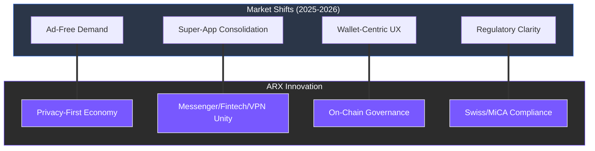

# 6.2 Market Trends

The digital landscape in 2026 is defined by a massive shift away from centralized data extraction toward sovereign, multi-functional ecosystems. ARX is positioned at the forefront of these five critical market shifts:

### The Convergence of Privacy and Utility

* **Messenger Monetization Fatigue:** Users are increasingly abandoning ad-driven platforms that harvest personal data. There is a clear migration toward private ecosystems where the business model aligns with user sovereignty rather than data exploitation.
* **The "Super-App" Consolidation:** Following the success of platforms like WeChat and Telegram, it is proven that messaging is the ultimate interface for digital life. ARX evolves this concept by integrating self-custodial finance and decentralized connectivity directly into the chat layer.
* **Web3-Native Coordination:** Wallet-based identity has become the standard for secure interaction. Messaging is now the most intuitive "front-end" for triggering smart contracts, managing DAOs, and coordinating decentralized work.
* **Infrastructure Decentralization:** Traditional server-client architectures are being replaced by validator-based relays. The **Proof-of-Relay** consensus ensures that network uptime and censorship resistance are mathematically guaranteed, not just promised.
* **Regulatory Maturity:** With frameworks like **MiCA** in Europe and global shifts in stablecoin policy, the era of "shadow" crypto is ending. ARX’s Swiss-based structure and tiered KYC model prove that absolute privacy can coexist with institutional-grade compliance.

---

### Strategic Alignment

By capitalizing on these trends, ARX moves beyond being a simple tool and becomes a comprehensive infrastructure for the next generation of the internet.


**The Shift to Sovereign Systems**
In the current market, "Convenience" is no longer enough. Users are demanding **Convenience + Control**. ARX is built to fulfill this dual requirement by offering a seamless UX backed by decentralized security.
