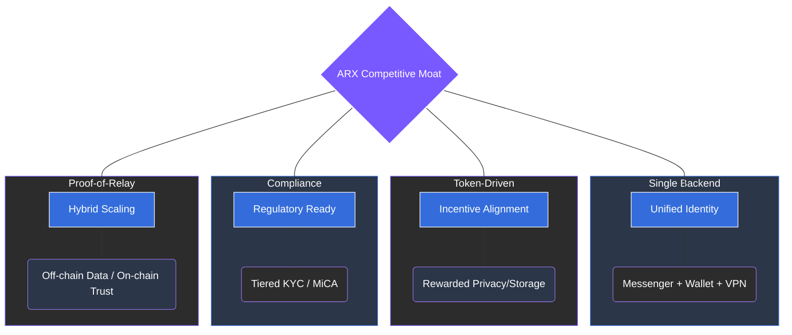

# 6.4 ARX’s Competitive Advantages

ARX does not simply offer a suite of features; it introduces a new paradigm for digital interaction. By synthesizing high-end privacy with real-world utility, ARX establishes a competitive moat based on technical coherence and economic alignment.

### Messenger-Centric Ecosystem
ARX transforms the messenger from a simple communication tool into a **universal coordination layer**. Every transaction, governance action, or network connection originates within the chat interface. This unification builds user habit and loyalty while ensuring that the user remains in total control of their digital interactions.

### Unified Architecture
Unlike fragmented competitors, all ARX modules—messenger, wallet, network, and cloud storage—share a **single identity and backend infrastructure**. The same wallet that signs an encrypted message can authorize a payment, secure a VPN relay, or fragment a file for decentralized storage. This coherence significantly reduces user friction and strengthens the network effect.

### Aligned Incentives
While traditional platforms monetize user data, ARX aligns network interests via the **ARX token**.
* **Users & Developers:** Earn rewards for building mini-apps or participating in the ecosystem.
* **Node Operators:** Receive token rewards for providing bandwidth (VPN) and storage capacity (Cloud), making data privacy a measurable and rewarded network function.

### Privacy with Compliance
ARX implements a **tiered participation model** that satisfies both individual privacy and institutional regulatory requirements.
* **Anonymous Tier:** Messaging, VPN, and storage access are available without identification.
* **Verified Tier:** Enables merchants and financial services to operate under **MiCA** and **FATF** guidelines, bridging the gap between Web3 and traditional finance.

### Sustainable Token Economy
Revenue is generated through premium subscriptions, transaction micro-fees, and storage plans. These funds are redistributed to validator rewards and the **DAO treasury**, ensuring long-term sustainability without ever resorting to advertising or data monetization.

### Technological Differentiation
The **Proof-of-Relay (PoR)** architecture separates encrypted communication and file storage from on-chain coordination. Files and messages are stored off-chain in encrypted fragments, while staking and governance remain verifiable on-chain. This hybrid design provides the perfect balance of scalability and accountability.


**The ARX Moat**
By solving the "Privacy vs. Usability" trade-off, ARX creates a unique market position. It is the only ecosystem where security is a mathematical guarantee, and utility is as seamless as a traditional super-app.
