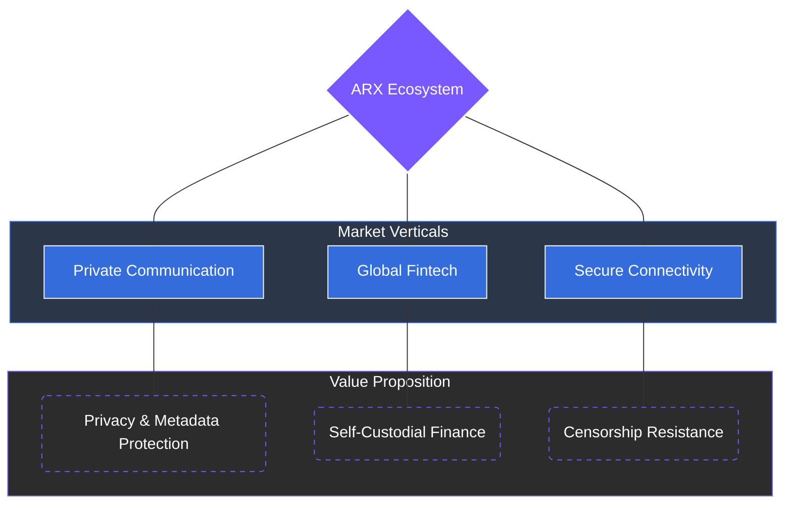

# 6 Market Opportunity

The global market for private communication, digital payments, and secure connectivity is growing rapidly. Users are increasingly demanding secure and compliant platforms that grant them total control over their data and identity while enabling frictionless interaction across borders.

### The Intersection of Sovereignty

ARX operates at the strategic intersection of three high-growth verticals. Together, these form the foundation of true digital sovereignty:

* **Communication:** Private, encrypted messaging that serves as the primary entry point to all ARX services.
* **Fintech:** A robust suite including a multi-chain wallet, pay-links, and a crypto card for seamless peer-to-peer and business transactions.
* **Connection:** A decentralized VPN (dVPN) and eSIM infrastructure providing private and censorship-resistant network access.

---

### The Messenger as the Cornerstone

The **ARX Messenger** is the cornerstone of this ecosystem. It acts as the primary interface for all user actions and serves as the coordination layer for both financial and network functionality.


**Unified Ecosystem Advantage**
By allowing users to communicate, transact, and connect from one secure environment, ARX eliminates the need for multiple centralized applications, reducing the user's digital footprint and increasing operational efficiency.
