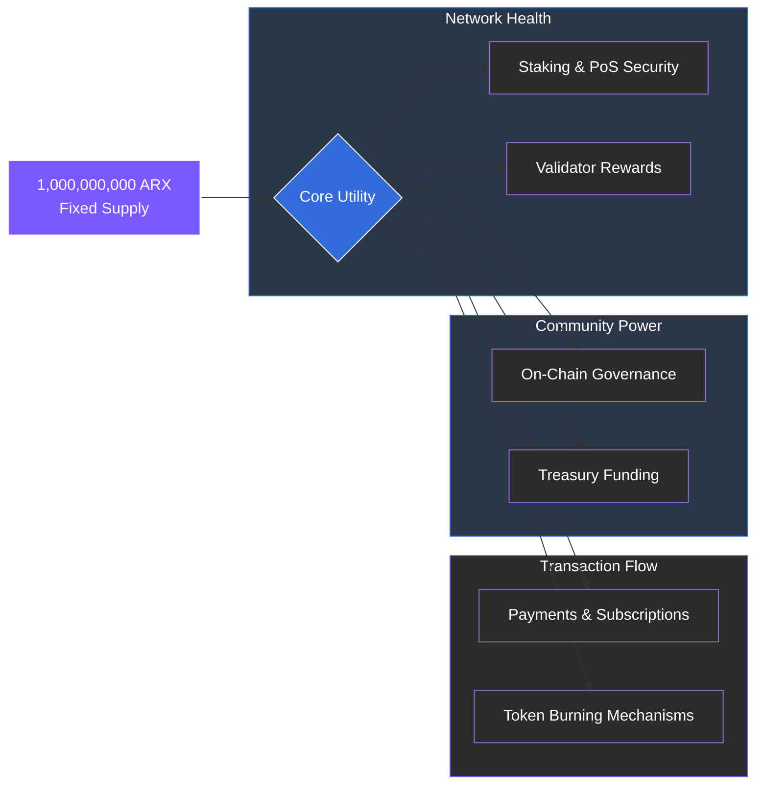

# 7.1 Token Specifications

The ARX token is designed with a fixed total supply and a transparent emission schedule to ensure long-term scarcity and economic predictability. As the native asset of the Cosmos SDK–based ARX chain, it facilitates high-speed transactions and robust network security.

### Core Parameters

| **Parameter** | **Description** |
| :--- | :--- |
| **Token Name** | ARX |
| **Token Type** | Governance and utility token (Cosmos SDK–based network) |
| **Total Supply** | 1,000,000,000 ARX (Fixed Cap) |
| **Emission Model** | Tail emission, declining from 4% annually to 0% over 10 years |
| **Decimals** | 6 |
| **Consensus Integration** | Native staking and governance across the ARX Proof-of-Stake chain |
| **Primary Use Cases** | Payments, Staking, Governance, Validator Rewards, Subscription Fees, Burning, and Affiliate Rewards |

---

### Supply Dynamics

By utilizing a fixed supply cap and a 10-year declining emission model, ARX transitions from an initial growth phase toward a fully self-sustaining economy driven by transaction volume and service fees rather than inflation.


**Predictable Scarcity**
The fixed supply of 1 billion tokens ensures that the ecosystem is protected against arbitrary inflation. As the network grows, the utility of each token increases without the dilution typical of centralized financial systems.
