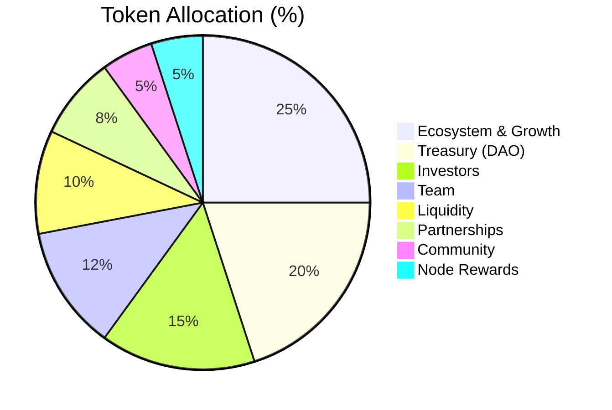

# 7.2 Token Distribution

The ARX token allocation is designed to balance long-term sustainability with immediate network utility. By prioritizing the Ecosystem and Treasury, the structure ensures that the network remains operationally independent while aligning the interests of founders, investors, and the community.

### Allocation Table

| **Category** | **Allocation** | **Vesting** | **Notes** |
| :--- | :--- | :--- | :--- |
| **Ecosystem and Growth** | 25% | Dynamic | Incentives, marketing campaigns, and strategic expansion. |
| **Treasury** | 20% | DAO Controlled | Long-term sustainability and operational funding. |
| **Investors** | 15% | 6m cliff, 24m vesting | Early contributors and strategic institutional partners. |
| **Team** | 12% | 12m cliff, 36m vesting | Founders and core contributors with long-term alignment. |
| **Liquidity** | 10% | Flexible | Exchange listings and market-making support. |
| **Partnerships** | 8% | Rolling | Strategic integrations and co-development initiatives. |
| **Community** | 5% | N/A | Airdrops, referral programs, and grassroots incentives. |
| **Node Rewards** | 5% | Bootstrap Phase | Initial validator incentives for the network launch. |

---

### Strategic Alignment

This structure prevents market oversaturation during the early stages through disciplined vesting schedules. The significant allocation to the **DAO Treasury** and **Ecosystem Fund** guarantees that ARX can fund its own evolution and weather various market cycles.


**Vesting for Stability**
With cliffs ranging from 6 to 12 months for core stakeholders, the tokenomics are engineered to prevent short-term volatility and ensure that those with the most influence are committed to the network's multi-year roadmap.
