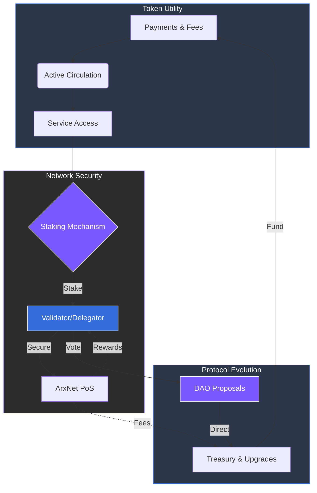

# 7.3 Utility and Governance Functionality

The ARX token serves as the foundation of all network activity, aligning user incentives with protocol security and growth. By acting as the universal medium of exchange and the primary tool for consensus, the token ensures that every participant has a stake in the network’s long-term success.

### Utility Functions

* **Payments and Fees:** ARX is the native currency for all transactions, premium subscriptions, VPN/eSIM access, and specialized in-app services.
* **Staking:** To secure the network, validators and delegators lock their ARX. In return, they earn performance-based rewards and a share of the transaction fees.
* **Rewards and Incentives:** The network automatically distributes ARX to active users, developers building on the platform, and node operators who provide critical infrastructure.
* **Governance:** Token holders are the ultimate decision-makers. Possession of ARX grants the right to propose and vote on protocol upgrades, treasury allocations, and fundamental rule changes.

### Governance Mechanics

* **Validators:** Responsible for running high-performance nodes, validating relay traffic, and securing the Proof-of-Stake (PoS) consensus.
* **Delegators:** Allow any token holder to participate in security by staking ARX through trusted validators to earn proportional rewards without running hardware.
* **Block Producers:** A subset of top-performing validators that ensure maximum efficiency and near-instant transaction finality.
* **Voting & Execution:** Voting power is weighted by the amount of staked ARX. Once a proposal passes, the changes are automatically enacted through on-chain governance contracts.

---

### The Self-Sustaining Cycle

Through this structure, ARX combines practical utility with decentralized decision-making. Token holders directly shape the network’s evolution while earning rewards for supporting its infrastructure.


**Skin in the Game**
By requiring validators and voters to stake tokens, ARX ensures that those who influence the network's direction are economically incentivized to act in its best interest.
