# 7.4.1 Token Sale Referral and Tracking Program

To support transparent and community-driven token distribution, ARX implements an internal referral system during the public sale phase. This program empowers verified participants to act as ecosystem ambassadors, driving organic growth while tracking their impact in real time.

### Program Core Components

* **On-Chain Attribution:** Every successful referral is recorded directly on-chain. This ensures an immutable record of contribution, guaranteeing that rewards are calculated fairly and transparently.
* **Real-Time Dashboard:** Participants can access a dedicated interface within the ARX dashboard to generate unique links, monitor their referral count, and view the total contributions linked to their profile.
* **Fraud Prevention & Integrity:** To maintain the health of the token sale, the system utilizes **AI-driven fraud detection** and **KYC-integrated verification**. This prevents "sybil attacks," multi-accounting, and other fraudulent activities that could dilute community value.
* **Tiered Incentive Model:** Referral rewards are calculated based on the contribution tier of the referred party. This aligns the incentives of the referrer with the long-term success of the fundraising round.

---

### Reward Mechanics

Referral rewards are denominated in ARX tokens and are distributed at the formal close of the sale phase. Importantly, these rewards are allocated from a dedicated **Growth & Ecosystem** pool; they do not impact post-launch emission rates or create unexpected inflation.

```mermaid
graph TD
    %% Global Styling
    accTitle: ARX Referral Program Lifecycle
    accDescr: Visualizing the process from link generation to token distribution.

    subgraph PHASE_1 ["Ambassador Onboarding"]
        A[Verified Participant] -->|Generate| B[Unique Referral Link]
    end

    subgraph PHASE_2 ["Referral Activity"]
        B -->|Share| C[New Contributor]
        C -->|KYC + Buy| D{On-Chain Verification}
    end

    subgraph PHASE_3 ["Tracking & Detection"]
        D -->|Valid| E[Real-Time Dashboard Update]
        D -->|Fraud Detected| F[Automated Flag/Disqualify]
        E -->|Calculate| G[Reward Tier Assigned]
    end

    subgraph PHASE_4 ["Finalization"]
        G -->|Sale Close| H[ARX Reward Disbursement]
    end

    %% Apply Brand Palette
    style PHASE_1 fill:#2B3648,stroke:#346ddb,color:#fefeff
    style PHASE_2 fill:#2c2c2c,stroke:#7858ff,color:#fefeff
    style PHASE_3 fill:#2B3648,stroke:#346ddb,color:#fefeff
    style PHASE_4 fill:#2c2c2c,stroke:#7858ff,color:#fefeff

    style D fill:#7858ff,stroke:#fefeff,color:#fefeff
    style E fill:#346ddb,stroke:#fefeff,color:#fefeff
    style H fill:#7858ff,stroke:#fefeff,color:#fefeff
```


**Organic Community Growth**
By incentivizing early supporters to promote the network directly, ARX reduces reliance on expensive, centralized advertising and ensures that tokens are distributed into the hands of an engaged and active community.
