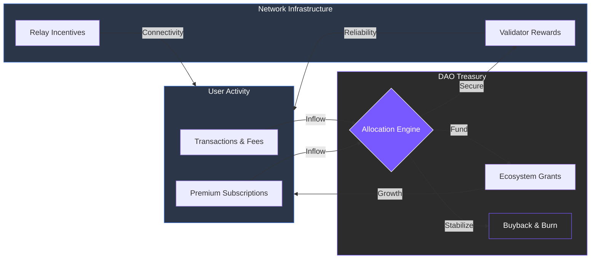

# 7.4 Economic Flow and Treasury Sustainability

The ARX economy maintains a self-balancing, circular structure where network activity continuously fuels ecosystem growth. By decoupling from external speculative funding and focusing on internal utility, ARX ensures that as the user base expands, the network’s financial foundation strengthens.

### The Economic Loop

The system is designed around a transparent flow of value, categorized into **Inflows (Sources)** that fund the network and **Outflows (Sinks)** that drive demand and maintain scarcity.

| **Sources (Inflows)** | **Sinks (Outflows)** |
| :--- | :--- |
| **Validator & Relay Rewards:** Earned through network security. | **Transaction Fees:** Paid for on-chain actions. |
| **Staking Yields:** Distributed to long-term token holders. | **Subscription Fees:** Premium VPN/eSIM/Cloud access. |
| **Treasury Disbursements:** Targeted funding for growth. | **Merchant Service Fees:** Charged for business pay-links. |
| **Development Grants:** Funded by the DAO for innovation. | **Buybacks & Burns:** DAO-approved deflationary events. |

---

### Treasury Management & DAO Oversight

The **ARX Treasury** acts as the central reserve for network expansion. Managed entirely by the DAO, it receives a percentage of all transaction fees and validator penalties. This pool is strategically allocated to ensure the protocol remains independent and self-sustaining.

**Treasury Allocation Priorities:**
* **Ecosystem Development:** Funding new "Mini-Apps" and core protocol upgrades.
* **Marketing & Acquisition:** Driving global user adoption and partnership integrations.
* **Security & Audits:** Ensuring the ongoing integrity of the code and infrastructure.
* **Liquidity & Stability:** Maintaining healthy market depth and network resilience.


**Autonomous Growth**
This closed-loop design ensures that ARX is not dependent on third-party advertisers. Instead