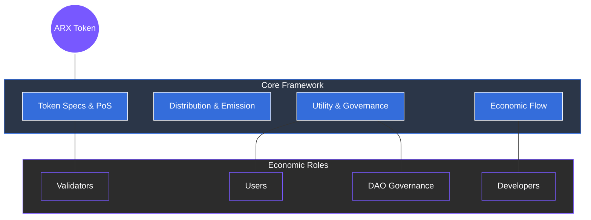

# 7 Tokenomics

The ARX token is the core economic engine of the ecosystem. It defines how value is generated, distributed, and sustained among users, validators, developers, and governance participants. Designed for long-term equilibrium, the token supports every layer of network coordination including payments, staking, rewards, and decision-making.

### Framework Overview

The ARX economy operates on a **"Stake & Earn"** and **"Use & Contribute"** model. This section details the framework that maintains network health:

* **Token Specifications:** Core parameters including total supply, emission rates, and integration with the ARX Proof-of-Stake (PoS) chain.
* **Distribution and Emission:** A fair allocation and inflation design that promotes predictability and gradual supply stabilization.
* **Utility & Governance:** Practical applications for payments, staking, and participating in on-chain decision-making.
* **Economic Flow & Sustainability:** Revenue sources, consumption mechanisms, and DAO-managed funding.

---

### A Circular Incentive Structure

ARX’s tokenomics eliminate reliance on advertising or custodial fees. Instead, it creates a circular, incentive-driven structure where transaction activity and service usage generate ongoing value. Over time, declining emissions transition the system toward self-sufficiency, supported by subscription revenues and DAO-managed treasury operations.


**The Sustainable Shift**
By linking token value to the actual utility and reliability of the network, ARX establishes a compliant digital economy where participants are directly rewarded for their contribution to private communication and secure connectivity.
