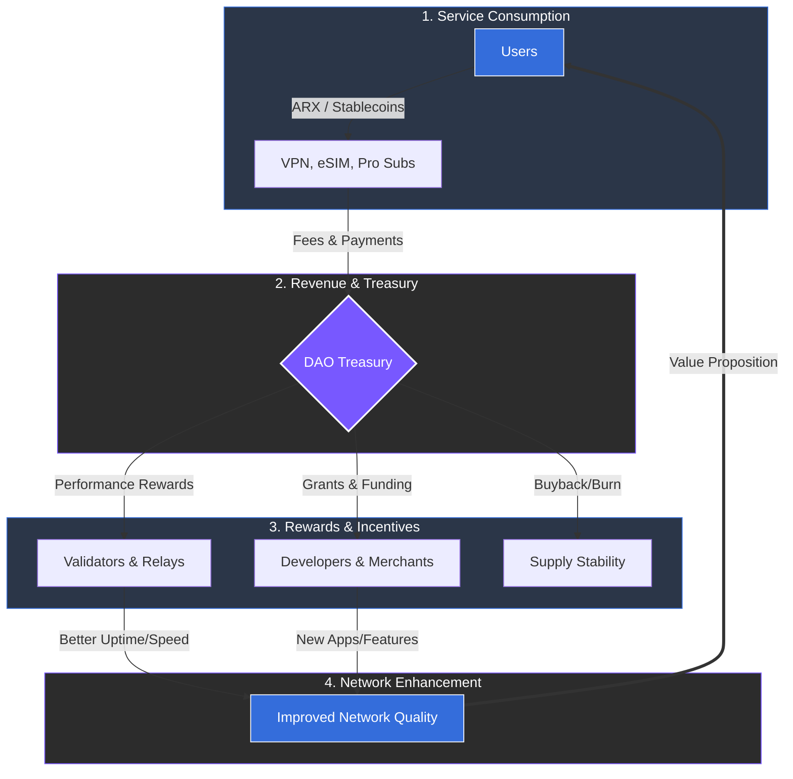

# 8.1 Circular Economy Design

ARX connects all participants through a continuous value cycle that transforms activity into revenue and reliability into reward. Unlike linear models that rely on external capital, the ARX economy is a self-sustaining loop where the utility of the network directly funds its own security and expansion.

### Value Flow Mechanics

The circular economy functions through four primary stages of interaction:

1. **User Consumption:** Users pay for essential services—such as **dVPN sessions, eSIM data, and Pro subscriptions**—using ARX tokens or supported stablecoins.
2. **Infrastructure Validation:** Validators and relay nodes provide the bandwidth and processing power required to fulfill these services. They are rewarded based on measurable performance, ensuring high service quality.
3. **Ecosystem Integration:** Merchants and developers utilize ARX for identity features and payment processing. Each integration generates micro-fees that contribute to the network's liquidity.
4. **Treasury Management:** The **DAO Treasury** acts as the steward of the economy. It collects network fees to fund rewards, drives growth initiatives, and executes community-approved buybacks to balance supply and demand.

---

### The ARX Flywheel

The efficiency of this model can be summarized by a simple, self-reinforcing loop:

**Users → Pay Fees → DAO Treasury → Rewards → Improved Network → More Users**


**Economic Resilience**
Every transaction within the ecosystem contributes to the network’s stability. As the user base grows, the "flywheel" spins faster, increasing the treasury's ability to fund better infrastructure, which in turn attracts more participants.
