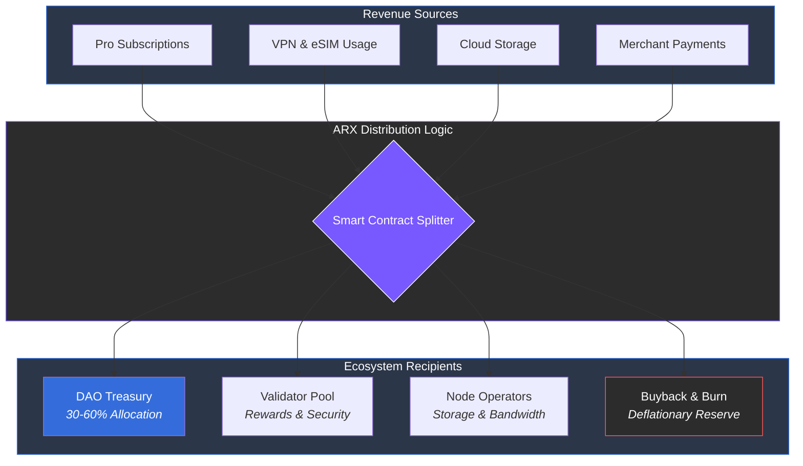

# 8.2 Revenue Streams

ARX generates diversified income from both the blockchain and service layers. This multi-channel structure ensures predictable, recurring revenues that decouple the network from external market volatility and eliminate the need for data-harvesting business models.

### 1. Pro Subscriptions
Premium features—including enhanced storage, multi-device sync, and message automation—are available via monthly or annual tiers.
* **Pricing:** $9.99 / $19.99 / $29.99 USD (payable in ARX or stablecoins).
* **Margin:** ~80% gross margin.
* **Distribution:** **60%** to DAO Treasury; **40%** to Validator rewards and core development.

### 2. VPN, eSIM, and Cloud Storage
Utility-driven revenue based on bandwidth, data consumption, and storage volume.
* **VPN:** $4.99–$9.99 per month.
* **eSIM:** Regional data packs priced according to local market rates.
* **Cloud Storage:** Competitive rates of **$0.010–$0.020 per GB/month**.
  * *Personal (100 GB):* $0.99–$1.99/mo
  * *Professional (500 GB–2 TB):* $5.99–$9.99/mo
* **Distribution:** **40%** to Node Operators, **30%** to DAO Treasury, **20%** to Relay/VPN Operators, and **10%** to Buyback Reserves.

### 3. Merchant and Payment Fees
Business users utilizing ARX PayLinks or checkout APIs contribute to the network through small processing fees.
* **Transaction Fee:** 0.3% – 0.5%.
* **Distribution:** **50%** to Validators, **30%** to the DAO, **20%** to Network Maintenance.

### 4. Transaction Micro-Fees
Minimal on-chain costs prevent spam and maintain validator uptime.
* **Fee:** ~0.001–0.002 ARX per transaction.
* **Distribution:** Split **50/50** between the Validator reward pool and the DAO Treasury.

---

### DAO Treasury Yields
The DAO manages its holdings by participating in staking, providing liquidity, or forming strategic partnerships. These returns are used for **token buybacks**, ecosystem grants, and long-term price stabilization.


**A Balanced Economic Mix**
By combining predictable subscription income with utility-driven service fees and cyclical DAO yields, ARX builds a financial foundation that remains robust regardless of broader crypto market cycles.
