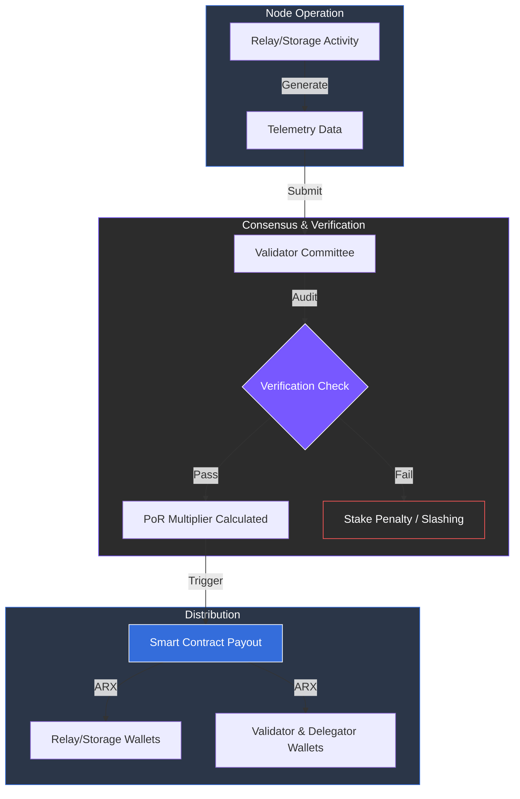

# 8.3 Proof-of-Relay Rewards Distribution

The **Proof-of-Relay (PoR)** mechanism is the cornerstone of the ARX service layer. It aligns economic rewards with measurable performance, ensuring that nodes providing critical services like bandwidth, message routing, and data storage are compensated fairly based on their actual contribution to the network.

### How the Reward Mechanism Works

The distribution process is automated and verifiable, following a three-step cycle:

1. **Submission:** Nodes submit verifiable telemetry data including latency, uptime, and message throughput to the consensus layer.
2. **Aggregation:** Validator committees aggregate these reports and cross-reference them with network-wide performance benchmarks to prevent spoofing.
3. **Distribution:** Smart contracts automatically calculate the final reward weight and distribute ARX tokens to the node's wallet.

---

### Reward Structure & Roles

The following table outlines the distribution logic for the various infrastructure roles within the ecosystem.

| **Role** | **Reward Share** | **Primary Source** | **Key Function** | **Optional Services** |
| :--- | :--- | :--- | :--- | :--- |
| **Relay Node** | 30–40% | PoR Metrics | Routing encrypted data & VPN/eSIM traffic. | VPN relay, eSIM routing, bandwidth provisioning. |
| **Storage Node** | 10–15% | PoS (Storage) | Hosting encrypted fragments & cloud backups. | Cloud storage, media hosting, backup redundancy. |
| **Validators** | 25–30% | PoS Consensus | Validating blocks and verifying PoR metrics. | Governance backbone, state integrity. |
| **Block Producers** | +5% Bonus | Priority Stake | Finalizing blocks and maintaining ledger state. | High-performance relaying. |
| **Delegators** | 10–15% | Validator Share | Staking ARX to support trusted validators. | N/A |
| **DAO Reserve** | 5% | Treasury Pool | Funding audits, bounties, and liquidity support. | N/A |

---

### Performance Accountability (Slashing)

To maintain a high standard of service, ARX implements strict penalty rules for underperforming or malicious nodes. Nodes that fail to meet minimum uptime or provide false metrics are subject to **slashing**:

* **Soft Slashing (0.5–1%):** Triggered by consistent downtime or high latency that disrupts the user experience.
* **Hard Slashing (1.5–2%):** Triggered by failed verification, data tampering, or malicious routing behavior.


**Efficiency Through Metrics**
The PoR structure ensures that "merit" is mathematically defined. By rewarding quality over quantity, ARX ensures a fast, reliable, and highly available decentralized network.
