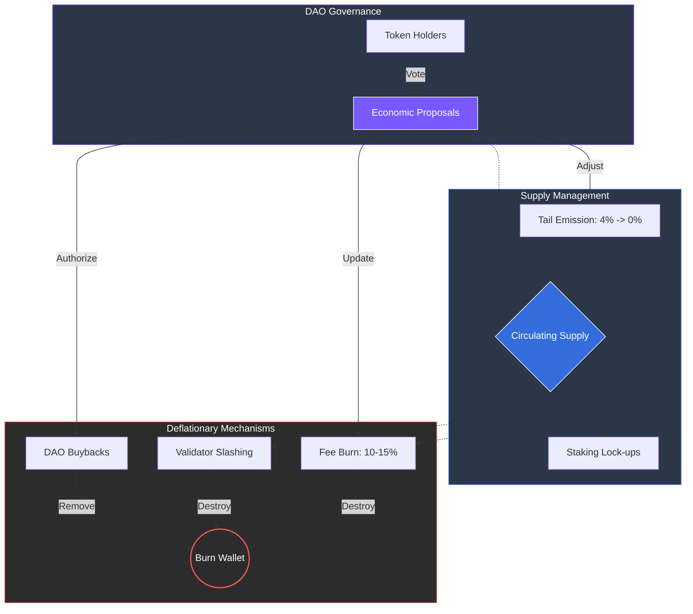

# 8.4 Deflation, Sustainability, and Governance Mechanisms

ARX maintains a balanced monetary system through controlled supply, adaptive governance, and revenue-backed deflation. This multi-layered approach ensures that as the platform’s utility grows, the economic scarcity of the ARX token is mathematically protected.

### Supply and Deflation Controls

To counteract early-stage inflation and reward long-term holders, ARX employs several autonomous deflationary "sinks":

* **Tail Emission:** Annual inflation begins at a modest **4%** and declines linearly to **0%** over a ten-year period, ensuring a predictable path to a fixed-supply state.
* **DAO Buybacks:** The DAO is empowered to repurchase tokens from the open market using surplus service revenues (from VPN, eSIM, and Storage), effectively returning value to the ecosystem.
* **Fee Recycling (Burn):** To link network usage directly to scarcity, **10–15%** of all collected network and subscription fees are automatically and permanently burned.
* **Validator Slashing:** Tokens seized from underperforming or malicious validators (**0.5–2%**) are burned rather than redistributed, serving as both a penalty and a deflationary event.

---

### Governance Integration

The ARX economy is not static; it is an evolving system managed by its participants. All key economic levers are controlled through on-chain voting:

* **Staking Rewards:** Adjusting yields to maintain optimal network security.
* **Emission Reduction:** Fine-tuning the speed of the transition to a zero-inflation model.
* **Buyback Ratios:** Determining the percentage of treasury surplus used for market support.


**Economic Sovereignty**
By placing economic policy in the hands of token holders, ARX ensures transparency and adaptability. This structure allows the network to transition smoothly from emission-funded incentives to a stable, service-driven economy.
