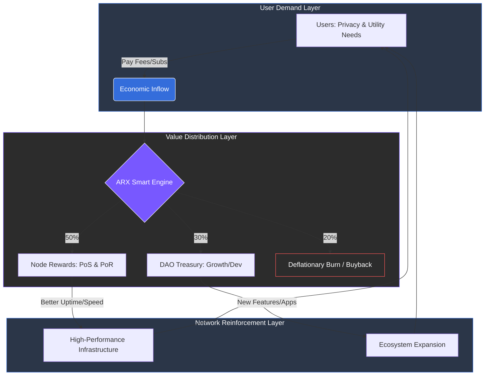

# 8 Economic Model

The ARX economic model is engineered for long-term sustainability, intentionally bypassing traditional monetization paths like advertising, custodial profit-taking, or purely speculative appreciation.

It functions as a **closed, circular economy** where every participant—from the casual messenger user to the enterprise validator—is rewarded based on their tangible contribution to privacy, network uptime, and decentralization. As the ecosystem matures throughout 2026 and beyond, ARX transitions from inflation-driven incentives to a self-sustaining model powered by organic demand for sovereign digital services.

### Core Economic Pillars

This section details the mechanisms that ensure the network's financial and operational longevity:

* **Circular Economy Design:** How value flows between users, nodes, and the treasury to create a "flywheel" effect.
* **Revenue Sources & Fee Structure:** A transparent breakdown of how the network generates value from messaging, fintech, and connectivity services.
* **Proof-of-Relay (PoR) Rewards:** The specific allocation logic that compensates node operators for bandwidth and uptime.
* **Deflationary & Governance Mechanisms:** The strategic use of fee burns and DAO-led adjustments to maintain long-term supply-demand equilibrium.

---

### The Shift to Self-Sufficiency

Unlike legacy "Web 2.0" models that treat user data as the product, ARX treats **network utility** as the primary value driver. By aligning technical performance with economic reward, the protocol ensures that the best interest of the user is always the best interest of the network.


**Beyond Speculation**
ARX is designed so that even in periods of low market volatility, the internal economy remains robust. Value is anchored in the daily necessity of private communication and secure global connectivity.
