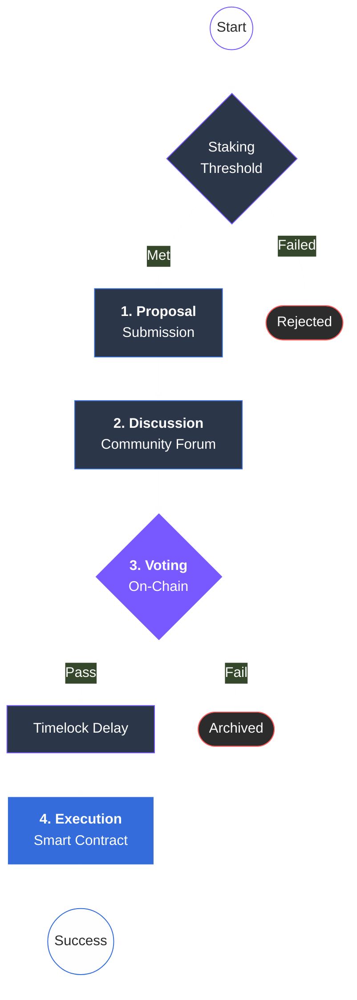

# 9.1 DAO Structure

The ARX DAO serves as the central coordination layer of the ecosystem, managing network evolution, treasury assets, and governance procedures through immutable smart contracts. By removing human intermediaries from the execution phase, the DAO ensures that the community's collective will is translated directly into protocol action.

### The Governance Lifecycle

The ARX governance process is designed to be rigorous yet accessible, ensuring that every change to the network undergoes thorough scrutiny before implementation.

* **Proposal Creation:** To maintain high-quality discourse and prevent spam, any ARX holder meeting a specific **staking threshold** can submit a formal proposal. These can range from technical protocol upgrades to treasury funding requests or adjusting network parameters.
* **Discussion Period:** Proposals are first hosted in the ARX Governance Forum. This stage is critical for community peer review, allowing for public debate, technical audits, and iterative revisions based on stakeholder feedback.
* **Voting Phase:** Once finalized, the proposal moves to an on-chain vote. Token holders participate through **Liquid Democracy**: they may vote directly or delegate their voting power to trusted representatives (Delegates) who align with their interests.
* **Automated Execution:** Unlike traditional organizations, approved proposals require no manual intervention. They are executed automatically via **on-chain contracts**, ensuring absolute transparency and eliminating any possibility of centralized "veto" or interference.

---


**Liquid Democracy at Work**
ARX utilizes a delegation model that allows passive holders to empower active community experts. This ensures that technical decisions are made with expertise while maintaining the decentralized nature of the voting pool.



**The Staking Threshold**
The requirement for a minimum staking threshold for proposal creation is a security feature. it ensures that proposers have significant "skin in the game" and are financially aligned with the long-term health of the ARX ecosystem.
