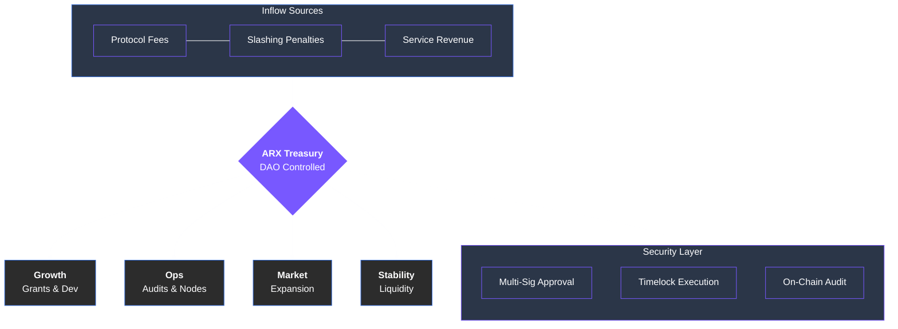

# 9.2 Treasury Management

The ARX Treasury functions as the financial foundation of the network. It operates as a decentralized reserve that collects protocol revenues, staking penalties, and unallocated tokens, redistributing these assets solely based on **DAO-approved proposals**.

### Primary Funding Areas

The Treasury is strategically utilized to ensure the network remains competitive, secure, and technologically advanced:

* **Ecosystem Growth:** Direct grants for developers building "Mini-Apps," validator incentives, and specialized research initiatives that expand the core ARX infrastructure.
* **Operations & Security:** Financing for high-performance relay and validator nodes, rigorous third-party security audits, and general infrastructure maintenance.
* **Marketing & Expansion:** Funding global user acquisition campaigns, strategic B2B partnerships, and educational outreach to onboard the next generation of privacy-conscious users.
* **Liquidity & Stability:** Management of DAO-controlled liquidity pools, exchange listings, and strategic buybacks to maintain token accessibility and long-term market balance.

---

### Control and Oversight

To ensure the highest level of accountability, ARX employs a multi-layered oversight framework:

1.  **On-Chain Transparency:** Every treasury movement—from inflow to disbursement—is recorded on the public ledger, allowing real-time auditing by any community member.
2.  **DAO Mandate:** No funds can be released without a formal community vote, ensuring that expenditures align with the collective interests of token holders.
3.  **Security Mechanisms:** During the early stages of the network, **Multi-Signature (Multi-Sig) safe-guards** are implemented alongside timelocks to prevent unauthorized access while maintaining decentralized principles.


**Responsible Sustainability**
The Treasury is designed to hold a diverse basket of assets. By diversifying into stablecoins and protocol-owned liquidity, the ARX DAO ensures it can continue funding operations even during periods of high market volatility.
