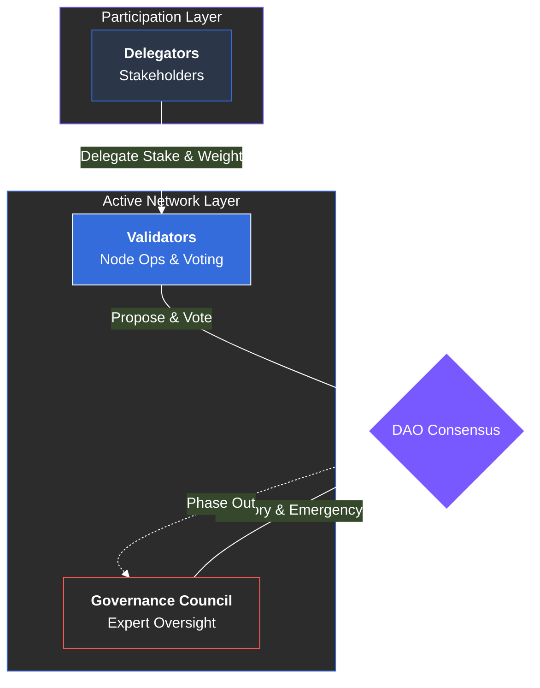

# 9.3 Governance Roles

Participation in the ARX governance ecosystem is inclusive and merit-based. To ensure high-quality decision-making and operational security, roles are structured into three distinct functional categories: **Validators**, **Delegators**, and a **Transitional Governance Council**.

### Validators (The Consensus Layer)
Validators are the active backbone of the network. They operate specialized hardware, validate transactions, and produce new blocks on the ARX chain.
* **Direct Governance:** Validators vote directly on critical proposals involving protocol upgrades, staking parameters, and treasury disbursements.
* **Performance Accountability:** A validator's influence is a combination of their own self-bonded stake and the trust (delegation) they receive from the community. High uptime and honest behavior are rewarded, while negligence results in **slashing**.

### Delegators (The Community Layer)
Delegators are ARX token holders who prefer not to run their own infrastructure but still want to contribute to the network’s security and governance.
* **Staking & Rewards:** By delegating ARX to a trusted validator, delegators earn a portion of the network rewards while helping to secure the chain.
* **Liquid Democracy:** Delegators participate in governance indirectly. By default, their voting weight is added to their chosen validator. However, most ARX governance tools allow delegators to **override** their validator’s vote if they disagree with a specific decision.

### Governance Council (Transitional Phase)
The Governance Council is a temporary, expert-led body designed to provide stewardship during the network’s early maturity stages.
* **Composition:** Composed of long-term ecosystem contributors, security researchers, and legal advisors.
* **Responsibilities:** Supervising critical security upgrades, managing emergency responses (e.g., stopping a malicious exploit), and refining the DAO’s technical rules.
* **Sunset Clause:** The council’s authority is designed to be **phased out**. As the decentralized community grows and reaches maturity benchmarks, the council is disbanded, transferring 100% of decision-making power to the DAO.

---


**A Roadmap to Full Autonomy**
The Transitional Governance Council acts as "training wheels" for the DAO. It ensures that the protocol is not crippled by early-stage indecision or governance attacks while the network builds its permanent decentralized consensus.



**Empowering Every Holder**
The delegation model ensures that you don't need to be a developer to have a voice. Whether you hold 100 ARX or 1,000,000, your stake contributes to the security and direction of the ecosystem.
